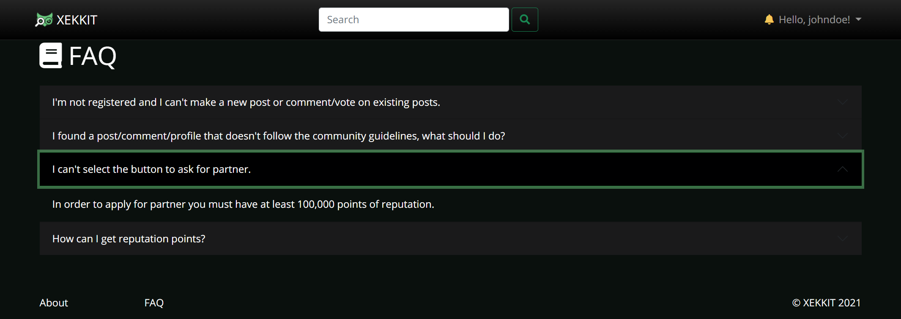

# 3. A3: User Interface Prototype

## 3.1 Interface and commmon features
**Xekkit** is a web application based on HTML5, JavaScript and CSS. The user interface was implemented using the Bootstrap framework.

|  |
|:--:| 
|Figure 1: Interface's guidelines.|
 1. Logo 
 2. Navbar  
 3. Content 
 4. Footer 

In this figure some characteristics common to all the pages are highlighted:

We opted for a "net design" to have a flowing web page layout that suits various screen sizes, from desktop 19" or more, to 11" tablets, or even to 4" smartphones.
The common links to the various pages maintain their position to make the user experience consistent.
Different sections have clearly distinct styles in order to highlight distinct hierarchies of information, and assist with the visual flow.

## 3.2 Sitemap

|  |
|:--:| 
| Figure 2: Sitemap. |

## 3.3 Wireflows

|  |
|:--:| 
| Figure 3: Wireflows of all interactions of the website, depending on the roles of the user. |

## 3.4 Interfaces
|Interfaces|
|:--:| 
| [UI01: Main](#ui01-main) | 
| [UI02: Main logged in](#ui02-main-logged-in) | 
| [UI03: About](#ui03-about) | 
| [UI04: FAQ](#uiI04-faq) | 
| [UI05: FAQ as Moderator](#ui05-faq-as-moderator) |
|  [UI06: Edit FAQ](#ui06-edit-faq) |
|  [UI07: Log in](#ui07-log-in) |
|  [UI08: Sign Up](#ui08-sign-up) |
|  [UI09: Post](#ui09-post) |
|  [UI10: Search](#ui10-search) |
| [UI11: Profile](#ui11-profile) |
|  [UI12: Third-Party Profile (Following)](#ui12-third-party-profile-following) |
| [UI13: Third-Party Profile (Not Following)](#ui13-third-party-profile-not-following) |
|  [UI14: Edit Profile Partner](#ui14-edit-profile-partner) |
|  [UI15: Edit Profile Not Partner](#ui15-edit-profile-not-partner) |
|  [UI16: Notifications](#ui16-notifications) |

### UI01: Main
|  |
|:--:| 
| Figure 4: [Main Page](http://lbaw2114-piu.lbaw-prod.fe.up.pt/pages/main.php). |

### UI02: Main logged in
|  |
|:--:| 
| Figure 5: [Main Page Logged in](http://lbaw2114-piu.lbaw-prod.fe.up.pt/pages/main_logged_in.php). |

### UI03: About
|  |
|:--:| 
| Figure 6: [About Page](http://lbaw2114-piu.lbaw-prod.fe.up.pt/pages/about_us.php). |

### UI04: FAQ
|  |
|:--:| 
| Figure 7: [FAQ Page](http://lbaw2114-piu.lbaw-prod.fe.up.pt/pages/faq). |

### UI05: FAQ as Moderator
|  |
|:--:| 
| Figure 8: [FAQ Moderator](http://lbaw2114-piu.lbaw-prod.fe.up.pt/pages/faq_moderator.php). |

### UI06: Edit FAQ
|  |
|:--:| 
| Figure 9: [Edit FAQ](http://lbaw2114-piu.lbaw-prod.fe.up.pt/pages/edit_faq.php). |

### UI07: Log in
|  |
|:--:| 
| Figure 10: [Log in](http://lbaw2114-piu.lbaw-prod.fe.up.pt/pages/login.php). |

### UI08: Sign Up
| |
|:--:| 
| Figure 11: [Sign Up](http://lbaw2114-piu.lbaw-prod.fe.up.pt/pages/register.php). |

### UI09: Post
| |
|:--:| 
| Figure 12: [Post](http://lbaw2114-piu.lbaw-prod.fe.up.pt/pages/news-php). |

### UI10: Search
| |
|:--:| 
| Figure 13: [Search](http://lbaw2114-piu.lbaw-prod.fe.up.pt/pages/search.php). |

### UI11: Profile
| |
|:--:| 
| Figure 14: [Profile](http://lbaw2114-piu.lbaw-prod.fe.up.pt/pages/profile.php). |

### UI12: Third-Party Profile Following
| |
|:--:| 
| Figure 15: [Third-Party Profile (Following)](http://lbaw2114-piu.lbaw-prod.fe.up.pt/pages/profile_other_unfollow.php). |

### UI13: Third-Party Profile Not Following
| |
|:--:| 
| Figure 16: [Third-Party Profile (Not Following)](http://lbaw2114-piu.lbaw-prod.fe.up.pt/pages/profile_other_follow.php). |

### UI14: Edit Profile Partner
| |
|:--:| 
| Figure 17: [Edit Profile Partner](http://lbaw2114-piu.lbaw-prod.fe.up.pt/pages/edit_profile_partner.php). |

### UI15: Edit Profile Not Partner
| |
|:--:| 
| Figure 18: [Edit Profile Not Partner](http://lbaw2114-piu.lbaw-prod.fe.up.pt/pages/edit_profile_no_partner.php). |

### UI16: Notifications
| |
|:--:| 
| Figure 19: [Notifications](http://lbaw2114-piu.lbaw-prod.fe.up.pt/pages/notifications.php). |

