# 3. A3: User Interface Prototype

This user interface prototype has the main goals of helping to identify and analyse the user requirements and preview the user interface of the website to be developed.  
This artifact includes an overview of the interface and common features, a sitemap and the identification and description of the main user interactions (UI) with the system.

## 3.1 Interface and commmon features
**Xekkit** is a web application based on HTML5, JavaScript and CSS. The user interface was implemented using the Bootstrap framework.

 
Figure 1: Interface's guidelines.
 1. Logo 
 2. Navbar  
 3. Content 
 4. Footer 

In this figure some characteristics common to all the pages are highlighted:

We opted for a "net design" to have a flowing web page layout that suits any screen size.
The common links to the various pages maintain their position to make the user experience consistent.
Different sections have clearly distinct styles in order to highlight distinct hierarchies of information, and assist with the visual flow.

## 3.2 Sitemap

The site map gives the team an idea of the website structure and pages hierarchy.

 

Figure 2: [Sitemap](https://projects.invisionapp.com/freehand/document/yc9IALtkz).

## 3.3 Wireflows

Wireflows are presented to represent some of the main user interactions with the website.

 

Figure 3: [Wireflows](https://projects.invisionapp.com/freehand/document/yc9IALtkz). 

## 3.4 Interfaces
|Interfaces|
|----------| 
| [UI01: Main](#ui01:-main) | 
| [UI02: Main logged in](#ui02:-main-logged-in) | 
| [UI03: New Post](#ui03:-new-post) |
| [UI04: About](#ui04:-about) | 
| [UI05: FAQ](#ui05:-faq) | 
| [UI06: FAQ as Moderator](#ui06:-edit-faq-as-moderator) |
| [UI07: Log in](#ui07:-log-in) |
| [UI08: Sign Up](#ui08:-sign-Up) |
| [UI09: Post](#ui09:-post) |
| [UI10: Search](#ui10-search) |
| [UI11: Third-Party Profile](#ui11:-third-party-profile) |
| [UI12: My Profile](#ui12:-my-profile) |
| [UI13: Edit Profile](#ui13:-profile-partner) |
| [UI14: Ask For Partner](#ui14:-ask-for-partner) |
| [UI15: Notifications](#ui15:-notifications) |
| [UI16: Moderator Options](#ui16:-moderator-options) |

### UI01: Main

Main website page where you can consult trending news on top, last news on center and explore some tags on the right side.

| Desktop | Mobile |
|---------|--------|
|  |  |

Figure 4: [Main Page](http://lbaw2114-piu.lbaw-prod.fe.up.pt/pages/main.php). 

### UI02: Main logged in

Main website page again with the difference that because of beeing logged in you can now create a new post.

| Desktop | Mobile1 | Mobile2 |
|---------|---------|---------|
|  |  | 

Figure 5: [Main Page Logged in](http://lbaw2114-piu.lbaw-prod.fe.up.pt/pages/main_logged_in.php). 

### UI03: New Post

Modal box where you can create a new post when logged in.

| Desktop | Mobile |
|---------|--------|
|  |  | 

Figure 6: [New Post](http://lbaw2114-piu.lbaw-prod.fe.up.pt/pages/main_logged_in.php) and then click on green button "Make new post".

### UI04: About

In this page you can see our team and where we got our inspiration to build this website.

| Desktop | Mobile |
|---------|--------|
| 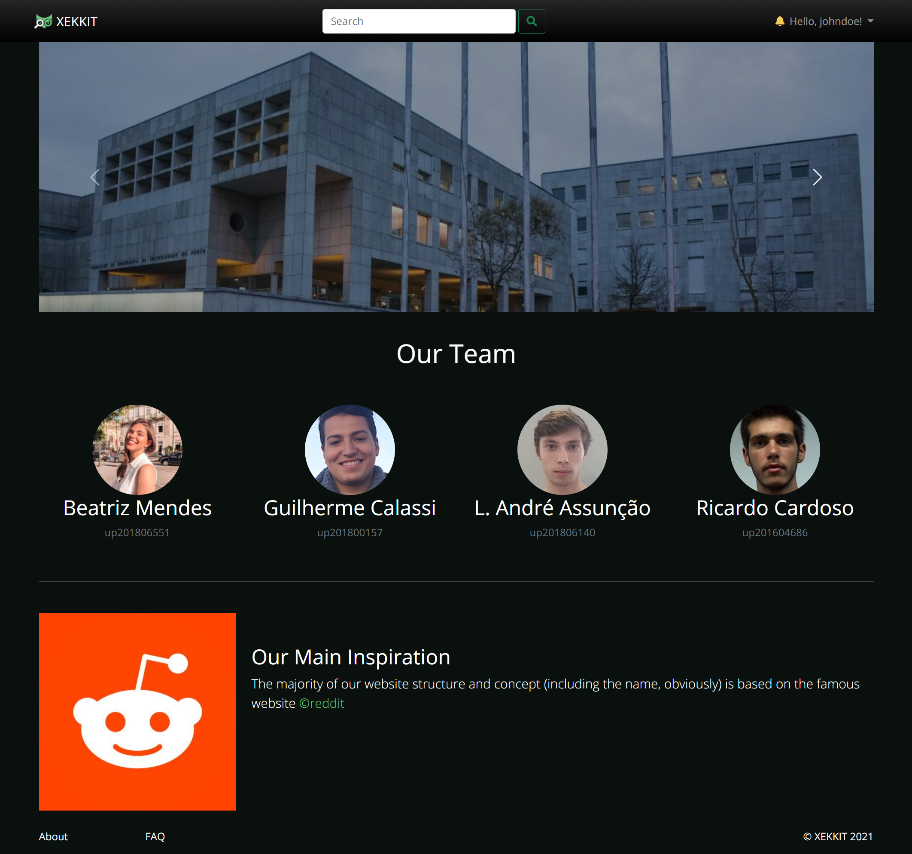 |  |
 
 Figure 6: [About Page](http://lbaw2114-piu.lbaw-prod.fe.up.pt/pages/about_us.php).

### UI05: FAQ

Here is were you can se some of the most frequently asked questions about our website.

| Desktop | Mobile |
|---------|--------|
|  | 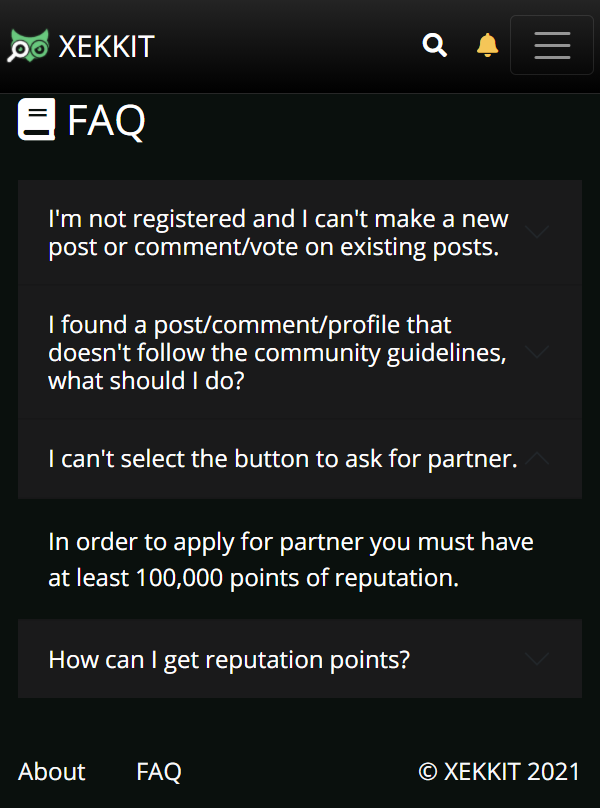 |

Figure 7: [FAQ Page](http://lbaw2114-piu.lbaw-prod.fe.up.pt/pages/faq).

### UI06: Edit FAQ as Moderator

Here is were the motherator can edit and add questions to the FAQ page.

| Desktop | Mobile |
|---------|--------|
| 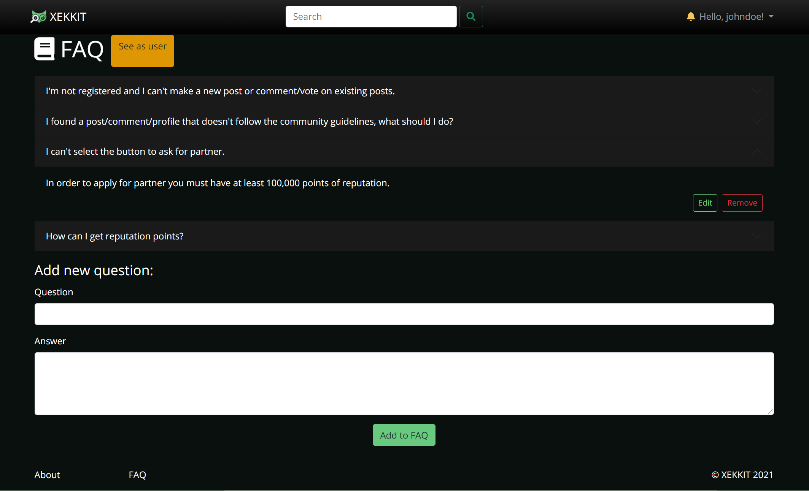 | 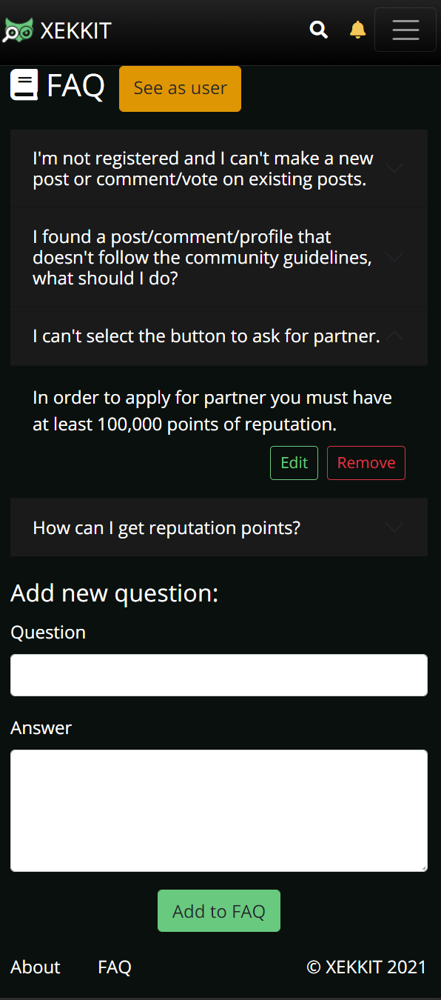 |
 
Figure 8: [FAQ Moderator](http://lbaw2114-piu.lbaw-prod.fe.up.pt/pages/faq_moderator.php).

### UI07: Log in

In this page you can authenticate yourself in our website (if you already have an account).

| Desktop | Mobile |
|---------|--------|
|  |  |

Figure 10: [Log in](http://lbaw2114-piu.lbaw-prod.fe.up.pt/pages/login.php).

### UI08: Sign Up

In this page yopu can create a new account.

| Desktop | Mobile |
|---------|--------|
| 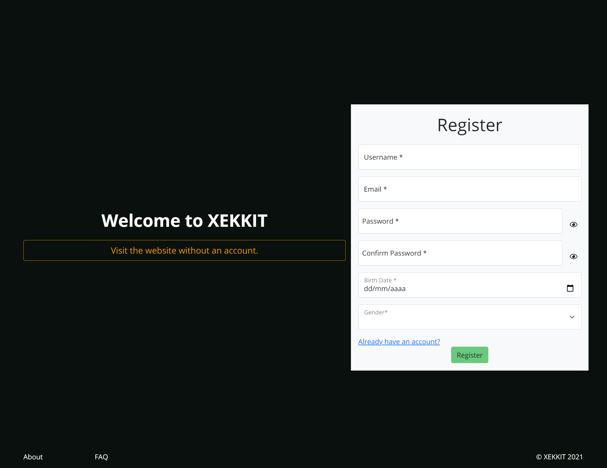 |  |

Figure 11: [Sign Up](http://lbaw2114-piu.lbaw-prod.fe.up.pt/pages/register.php).

### UI09: Post

This is the page were single news are presented, with the respective comments below. On desktop version you can see a card with some publisher info, while on mobile you can only see his name (with a link to his profile) on the top of the post card.  
If you are the owner of the post you are seeing, you have the option to edit or delete the post, but if you are not the owner a report button will appear instead.

| Desktop | Mobile |
|---------|--------|
| | 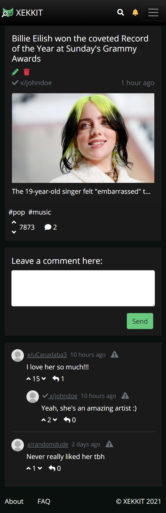|

Figure 12: [Post](http://lbaw2114-piu.lbaw-prod.fe.up.pt/pages/news-php).

### UI10: Search

When you perform a search query (by typing on the serach bar) this is tha page were you land. In here you can filter your search and choose if you want to search for news or for users.

| Desktop | Mobile |
|---------|--------|
| | |
| | 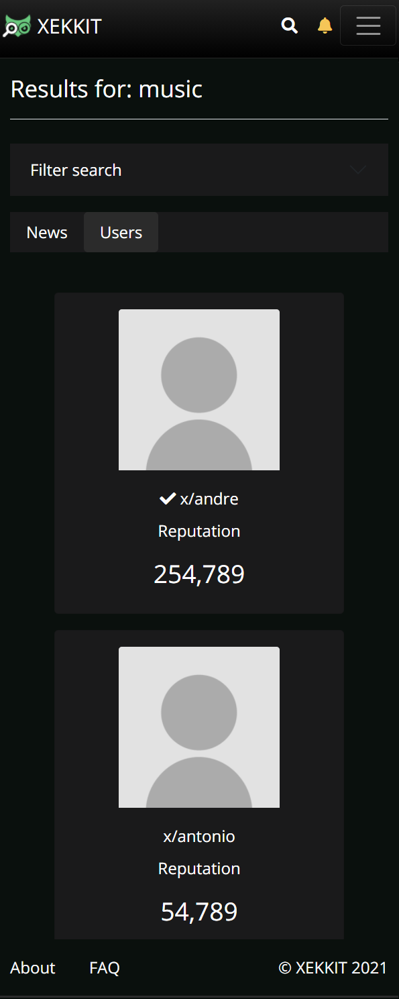|
 
Figure 13 and 14: [Search](http://lbaw2114-piu.lbaw-prod.fe.up.pt/pages/search.php).

### UI11: Third-Party Profile

This is how you can see other people's profiles. On the desktop version is an example of someone you don't follow, while on mobile version is an example of someone you follow. In this page you can not only see this user's posted news but also who he follows.

| Desktop | Mobile |
|---------|--------|
| | |
| | 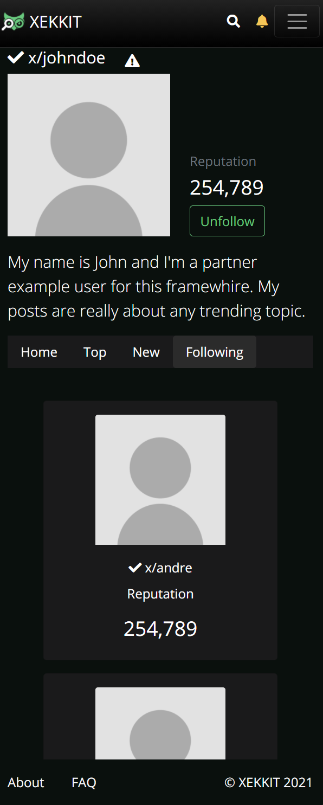|

Figure 15 and 16: [Third-Party Profile (unfollow button)](http://lbaw2114-piu.lbaw-prod.fe.up.pt/pages/profile_other_unfollow.php) and [Third-Party Profile (follow button)](http://lbaw2114-piu.lbaw-prod.fe.up.pt/pages/profile_other_follow.php).

### UI12: My Profile

This is how you can see your own profile. The difference between this page and the previous one is that you can't report/follow yourself but you can edit yourprofile.

| Desktop | Mobile |
|---------|--------|
|  | |

Figure 17: [My Profile](http://lbaw2114-piu.lbaw-prod.fe.up.pt/pages/profile.php).

### UI13: Edit Profile

This is an example of how you can edit your profile. On the desktop version is an example of someone who is not Partner while on the mobile version is an example of someone that is partner.

| Desktop | Mobile |
|---------|--------|
| | 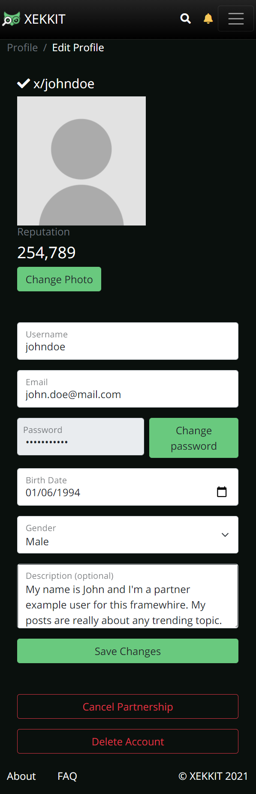|

Figure 18: [Edit Profile Partner](http://lbaw2114-piu.lbaw-prod.fe.up.pt/pages/edit_profile.php) and [Edit Profile non Partner](http://lbaw2114-piu.lbaw-prod.fe.up.pt/pages/edit_profile_no_partner.php).

### UI14: Ask for Partner

When you click the button "Ask for Partner" a modal box will appear where you must describe why we should accept you as Partner.

| Desktop | Mobile |
|---------|--------|
|  |  |

Figure 19: [Edit Profile](http://lbaw2114-piu.lbaw-prod.fe.up.pt/pages/edit_profile.php) and then click on yellow button "Ask for Partner".

### UI15: Notifications

When you click the yellow bell on the navigantion bar you end up in this page where you can see who voted/commented on your posted news.

| Desktop | Mobile |
|---------|--------|
|  |  |

Figure 20: [Notifications](http://lbaw2114-piu.lbaw-prod.fe.up.pt/pages/notifications.php).

### UI16: Moderator Options

If you are a moderator of our website you will also have access to a tab inside the notifications page where you can manage moderator related events, sush as manage Partner/report requests.

| Desktop | Mobile |
|---------|--------|
| 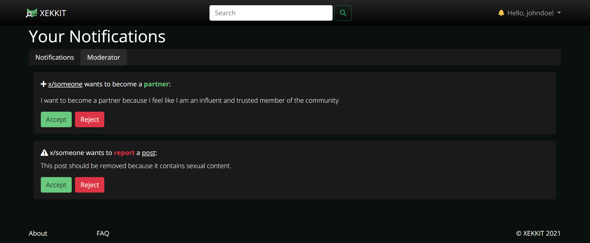 | 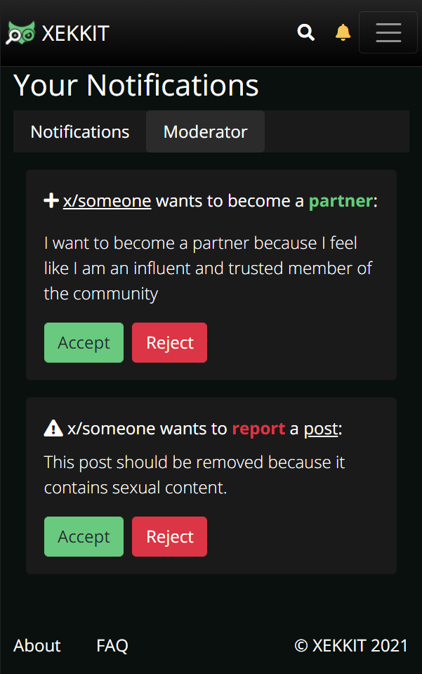 |

Figure 21: [Moderator Options](http://lbaw2114-piu.lbaw-prod.fe.up.pt/pages/notifications.php) and then click on "Moderator" tab.
