# 3. A3: User Interface Prototype

This user interface prototype has the main goals of helping to identify and analyse the user requirements and preview the user interface of the website to be developed.  
This artifact includes an overview of the interface and common features, a sitemap and the identification and description of the main user interactions (UI) with the system.

## 3.1 Interface and commmon features
**Xekkit** is a web application based on HTML5, JavaScript and CSS. The user interface was implemented using the Bootstrap framework.

| 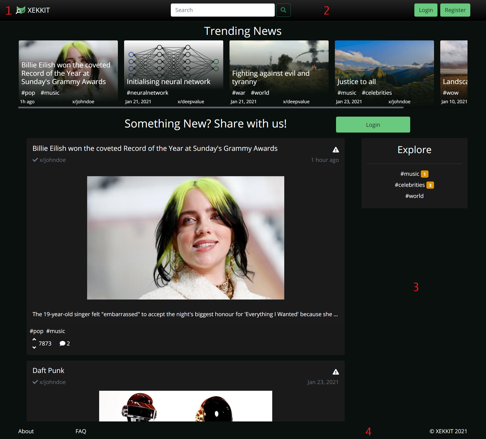 |
|:--:| 
|*Figure 1: Interface's guidelines.*|
 1. Logo 
 2. Navbar  
 3. Content 
 4. Footer 

In this figure some characteristics common to all the pages are highlighted:

We opted for a "net design" to have a flowing web page layout that suits any screen size.
The common links to the various pages maintain their position to make the user experience consistent.
Different sections have clearly distinct styles in order to highlight distinct hierarchies of information, and assist with the visual flow.

## 3.2 Sitemap

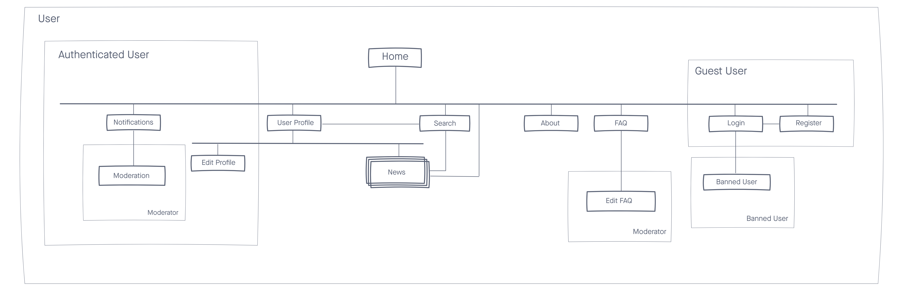 

Figure 2: [Sitemap](https://projects.invisionapp.com/freehand/document/yc9IALtkz).

## 3.3 Wireflows

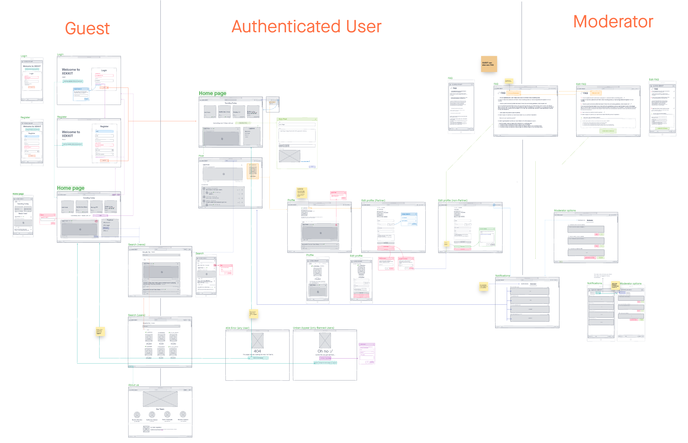 

Figure 3: [Wireflows](https://projects.invisionapp.com/freehand/document/yc9IALtkz). 

## 3.4 Interfaces
|Interfaces|
|----------| 
| [UI01: Main](#ui01:-main) | 
| [UI02: Main logged in](#ui02:-main-logged-in) | 
| [UI03: About](#ui03:-about) | 
| [UI04: FAQ](#ui04:-faq) | 
| [UI05: FAQ as Moderator](#ui05:-edit-faq-as-moderator) |
| [UI06: Log in](#ui06:-log-in) |
| [UI07: Sign Up](#ui07:-sign-Up) |
| [UI08: Post](#ui08:-post) |
| [UI09: Search](#ui09-search) |
| [UI10: Third-Party Profile](#ui10:-third-party-profile) |
| [UI11: My Profile](#ui11:-my-profile) |
| [UI12: Edit Profile](#ui12:-profile-partner) |
| [UI13: Ask For Partner](#ui13:-ask-for-partner) |
| [UI14: Notifications](#ui14:-notifications) |
| [UI15: Moderator Options](#ui15:-moderator-options) |
| [UI16: New Post](#ui16:-new-post) |

### UI01: Main
| Desktop | Mobile |
|---------|--------|
|  |  |

Figure 4: [Main Page](http://lbaw2114-piu.lbaw-prod.fe.up.pt/pages/main.php). 

### UI02: Main logged in
| Desktop | Mobile1 | Mobile2 |
|---------|---------|---------|
|  |  | 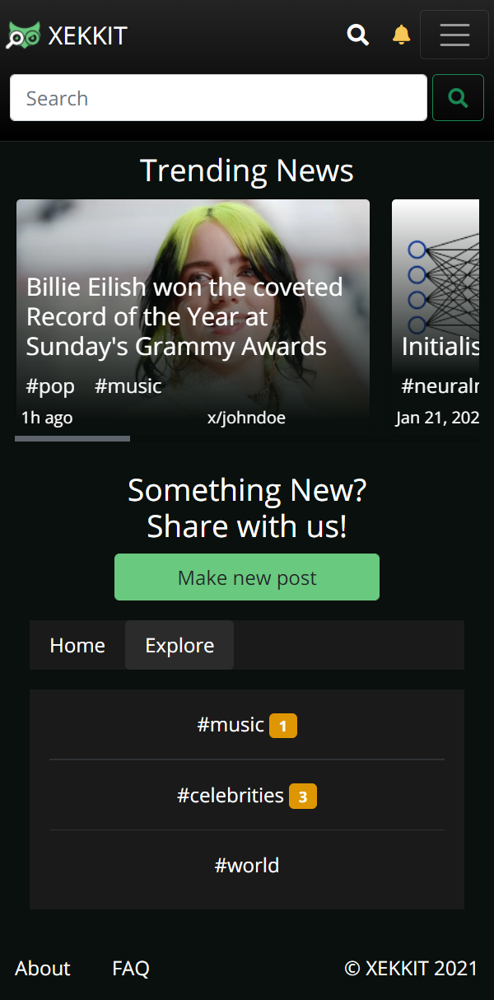

Figure 5: [Main Page Logged in](http://lbaw2114-piu.lbaw-prod.fe.up.pt/pages/main_logged_in.php). 

### UI03: About
| Desktop | Mobile |
|---------|--------|
|  | 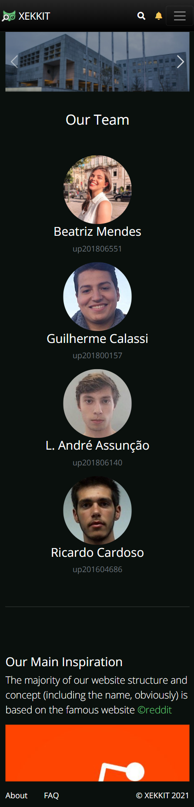 |
 
 Figure 6: [About Page](http://lbaw2114-piu.lbaw-prod.fe.up.pt/pages/about_us.php).

### UI04: FAQ
| Desktop | Mobile |
|---------|--------|
|  |  |

Figure 7: [FAQ Page](http://lbaw2114-piu.lbaw-prod.fe.up.pt/pages/faq).

### UI05: Edit FAQ as Moderator
| Desktop | Mobile |
|---------|--------|
|  |  |
 
Figure 8: [FAQ Moderator](http://lbaw2114-piu.lbaw-prod.fe.up.pt/pages/faq_moderator.php).

### UI06: Log in
| Desktop | Mobile |
|---------|--------|
| 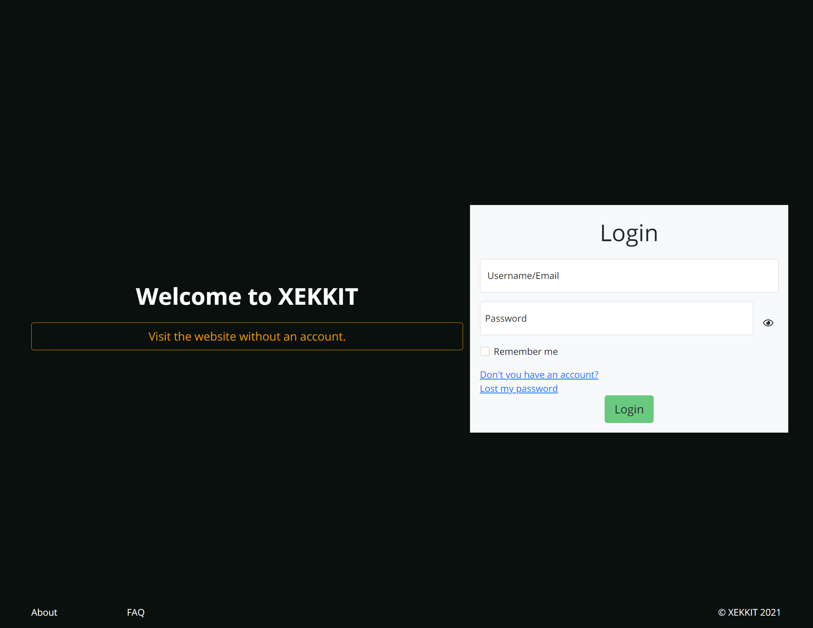 |  |

Figure 10: [Log in](http://lbaw2114-piu.lbaw-prod.fe.up.pt/pages/login.php).

### UI07: Sign Up
| Desktop | Mobile |
|---------|--------|
|  |  |

Figure 11: [Sign Up](http://lbaw2114-piu.lbaw-prod.fe.up.pt/pages/register.php).

### UI08: Post
| Desktop | Mobile |
|---------|--------|
| 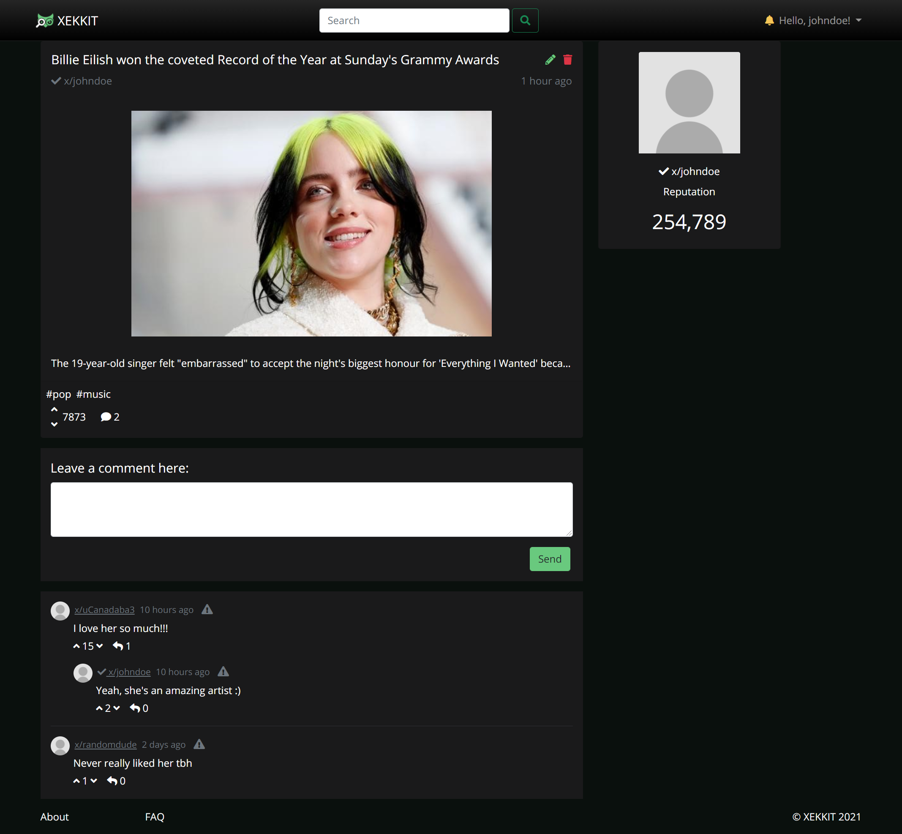| |

Figure 12: [Post](http://lbaw2114-piu.lbaw-prod.fe.up.pt/pages/news-php).

### UI09: Search
| Desktop | Mobile |
|---------|--------|
| | |
| | |
 
Figure 13 and 14: [Search](http://lbaw2114-piu.lbaw-prod.fe.up.pt/pages/search.php).

### UI10: Third-Party Profile
| Desktop | Mobile |
|---------|--------|
| 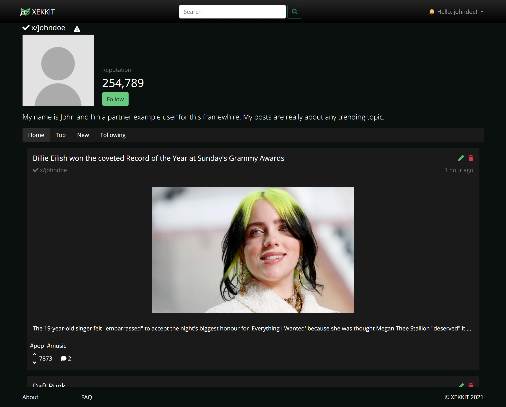| |
| | |

Figure 15 and 16: [Third-Party Profile (unfollow button)](http://lbaw2114-piu.lbaw-prod.fe.up.pt/pages/profile_other_unfollow.php) and [Third-Party Profile (follow button)](http://lbaw2114-piu.lbaw-prod.fe.up.pt/pages/profile_other_follow.php).

### UI11: My Profile
| Desktop | Mobile |
|---------|--------|
|  | 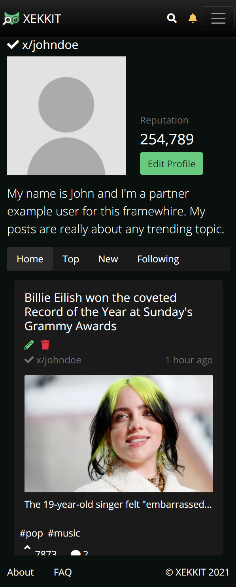|

Figure 17: [My Profile](http://lbaw2114-piu.lbaw-prod.fe.up.pt/pages/profile.php).

### UI12: Edit Profile
| Desktop | Mobile |
|---------|--------|
| 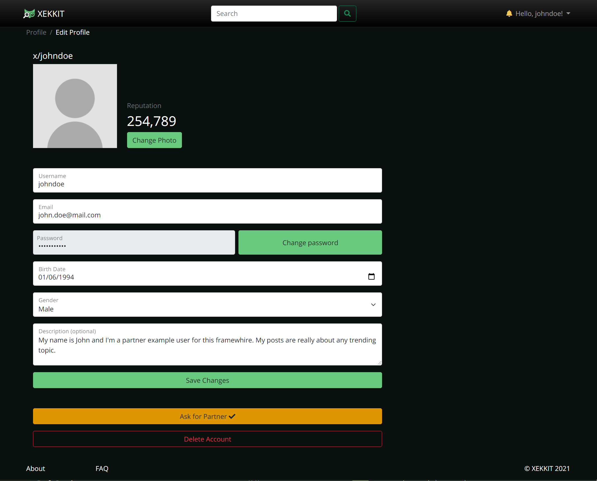| |

Figure 18: [Edit Profile Partner](http://lbaw2114-piu.lbaw-prod.fe.up.pt/pages/edit_profile.php) and [Edit Profile non Partner](http://lbaw2114-piu.lbaw-prod.fe.up.pt/pages/edit_profile_no_partner.php).

### UI13: Ask for Partner
| Desktop | Mobile |
|---------|--------|
| 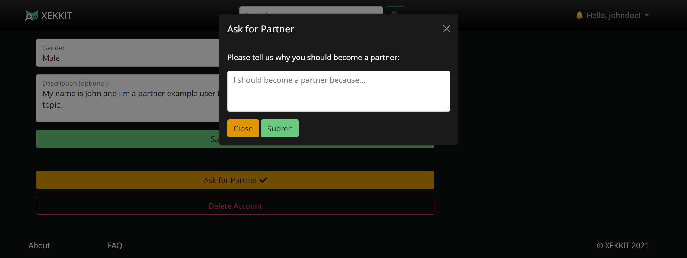 |  |

Figure 19: [Edit Profile](http://lbaw2114-piu.lbaw-prod.fe.up.pt/pages/edit_profile.php) and then click on yellow button "Ask for Partner".

### UI14: Notifications
| Desktop | Mobile |
|---------|--------|
| 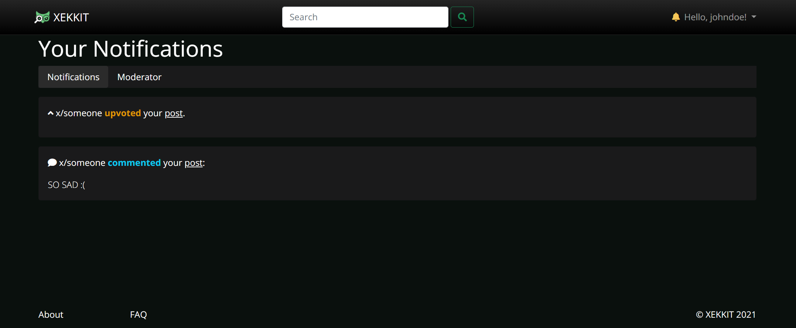 |  |

Figure 20: [Notifications](http://lbaw2114-piu.lbaw-prod.fe.up.pt/pages/notifications.php).

### UI15: Moderator Options
| Desktop | Mobile |
|---------|--------|
|  |  |

Figure 21: [Moderator Options](http://lbaw2114-piu.lbaw-prod.fe.up.pt/pages/notifications.php) and then click on "Moderator" tab.

### UI16: New Post
| Desktop | Mobile |
|---------|--------|
| 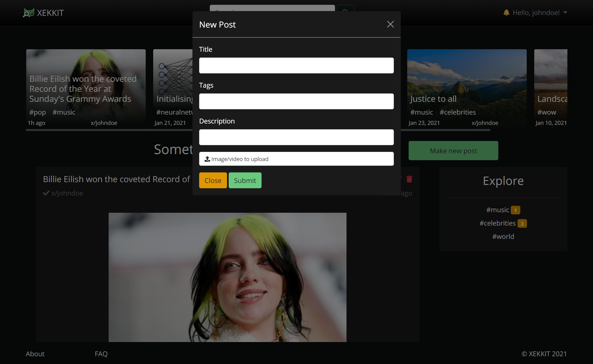 |  | 

Figure 19: [New Post](http://lbaw2114-piu.lbaw-prod.fe.up.pt/pages/main_logged_in.php) and then click on green button "Make new post".
