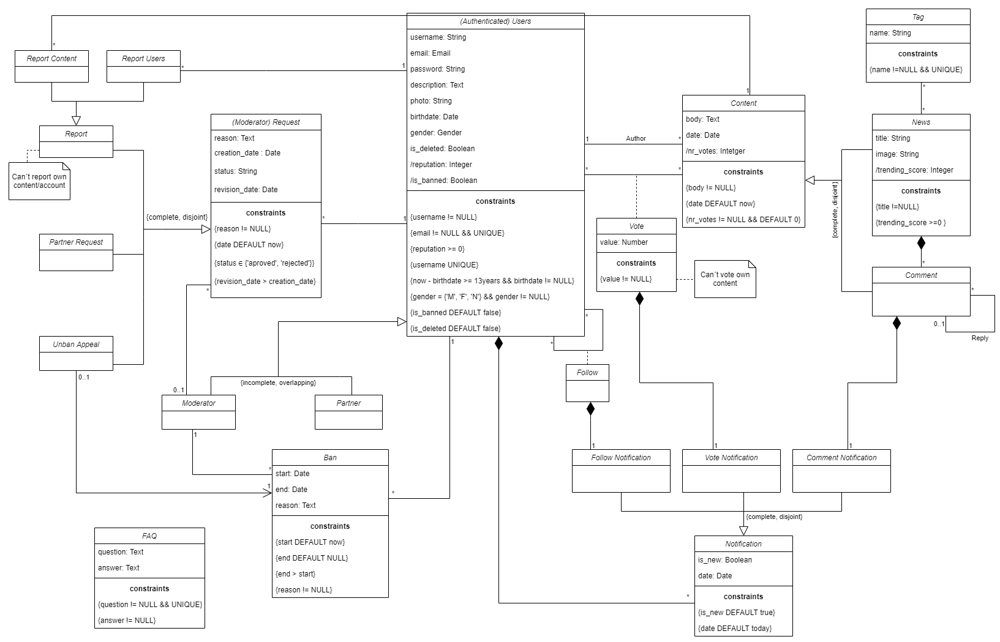

# EBD: Database Specification Component

This project intends to build a Collaborative news website, where anyone can read, publish news and share them with friends, while avoiding the spread of fake news.

## A4: Conceptual Data Model

The diagram of Figure 1 presents the main organisational entities, the relationships between them, attributes and their domains, and the multiplicity of relationships for **XEKKIT**.

### 1. Class Diagram

| |
|---|
|Figure 1: UML conceptual data model |

Generalizations:
* User - overlapping, incomplete
* Content - disjoint, complete
* Request - disjoint, complete
* Report - disjoint, complete
* Notification - disjoint, complete

### 2. Additional Business Rules
 
All business rules are represented in the UML diagram.

---

## A5: Relational Schema, validation and schema refinement

The artifact presented in this section contains the Relational Schema obtained by mapping from the Conceptual Data Model (A4). 

### 1. Relational Schema

| Relation reference | Relation Compact Notation                        |
| ------------------ | ------------------------------------------------ |
| R01                | users(**id**, username UK NN, email UK NN, password, description, photo UK, birthdate NN, gender NN CK gender IN GENDER_TYPE, reputation NN DF 0 CK reputation >= 0, is_moderator NN DF false, last_day_of_vote, count_last_day_rep DF 0, is_partner NN DF false, is_banned NN DF false, is_deleted NN DF false, search) |
| R02                | follow(**follower_id** → users NN, **users_id** → users NN)
| R03                | ban(**id**, users_id → users NN, moderator_id → users NN, start_date NN DF TODAY, end_date DF NULL CK end > start, reason NN) |
| R04                | content(**id**, author_id → users NN, body NN, date NN DF TODAY, nr_votes NN DF 0) |  
| R05                | tag(**id**, name NN UK) |
| R06                | news(**content_id** → content, title NN, image UK, trending_score NN CK trending_score >= 0, nr_comments NN DF 0) |
| R07                | news_tag(**news_id** → news NN, **tag_id** → tag NN ) |
| R08                | comment(**content_id** → content, news_id → news NN, reply_to_id → comment) |
| R09                | request(**id**, from_id → users NN, moderator_id → users, reason NN, creation_date NN DF TODAY, status CK status IN STATUS_TYPE, revision_date CK revision_date > creation_date) |
| R10                | report_users(**request_id** → request, to_users_id → users NN) |
| R11                | report_content(**request_id** → request, to_content_id → content) |
| R12                | partner_request(**request_id** → request) |
| R13                | unban_appeal(**request_id** → request, ban_id → ban NN) |
| R14                | vote(**users_id** → users, **content_id** → content, value NN) |
| R15                | follow_notification(**follower_id** → users, **users_id** → users, is_new NN DF true, creation_date DF TODAY) |
| R16                | vote_notification(**voter_id** → users, **content_id** → content, **author_id** → users, is_new NN DF true, creation_date DF TODAY) |
| R17                | comment_notification(**users_id** → users, **comment_id** → comment, is_new NN DF true, creation_date DF TODAY) |
| R18                | faq(**id**, question NN UK, answer NN) |

where UK means UNIQUE KEY, NN means NOT NULL, DF means DEFAULT and CK means CHECK.

#### 1.1 Generalizations
- **Content Generalization**: Subclasses point to the Superclass → the Content table has too many relations with other classes.
- **Request Generalization**: Subclasses point to the Superclass → each subclass will have different relations.
- **User Generalization**: One relation with all the attributes of all the classes → good approach for a heavily overlapping generalization with a small number of subclasses
- **Report Generalization**: Only subclasses are represented → there is no internal information stored in this classes, only external connections.
- **Notification Generalization**: Only subclasses are represented → it is a disjoint generalization and the few information that belongs to the superclass will be accessed every time we access the subclasses.

### 2. Domains

Specification of additional domains:  

| Domain Name  | Domain Specification        |
| ------------ | --------------------------- |
| GENDER_TYPE  | ENUM('m','f','n')           |
| TODAY        | DATE DEFAULT CURRENT_DATE   |
| STATUS_TYPE  | ENUM('aproved', 'rejected') | 


### 3. Schema validation

| **TABLE R01**   | users |
| --------------  | ---- |
| **Keys**        | {id}, {email}, {username}, {photo} |
| **Functional Dependencies:** |
| FD0101          | id → {username, email, password, description, photo, birthdate, gender, reputation, last_day_of_vote, count_last_day_rep, is_moderator, is_partner, is_banned, is_deleted} |
| FD0102          | username → {id, email, password, description, photo, birthdate, gender, reputation, last_day_of_vote, count_last_day_rep, is_moderator, is_partner, is_banned, is_deleted} |
| FD0103          | email → {id, username, password, description, photo, birthdate, gender, reputation, last_day_of_vote, count_last_day_rep, is_moderator, is_partner, is_banned, is_deleted} |
| FD0104          | photo → {id, email, username, password, description, birthdate, gender, reputation, last_day_of_vote, count_last_day_rep, is_moderator, is_partner, is_banned, is_deleted} |
| **NORMAL FORM** | BCNF |

| **TABLE R02**   | follow |
| --------------  | --- |
| **Keys**        | {follower_id, users_id} |
| **Functional Dependencies:** |
| (none) | |
| **NORMAL FORM** | BCNF |

| **TABLE R03**   | ban |
| --------------  | --- |
| **Keys**        | {id} |
| **Functional Dependencies:** |
| FD0501          | id → {users_id, moderator_id, start_date, end_date, reason} |
| **NORMAL FORM** | BCNF |

| **TABLE R04**   | content |
| --------------  | --- |
| **Keys**        | {id} |
| **Functional Dependencies:** |
| FD01701          | id → {author_id, body, date, nr_votes} |
| **NORMAL FORM** | BCNF |

| **TABLE R05**   | tag |
| --------------  | --- |
| **Keys**        | {id}, {name} |
| **Functional Dependencies:** |
| FD01101         | id → {name} |
| FD01101         | name → {id} |
| **NORMAL FORM** | BCNF |

| **TABLE R06**   | news |
| --------------  | ---- |
| **Keys**        | {content_id}, {image} |
| **Functional Dependencies:** |
| FD0901          | content_id → {title, image, trending_score, nr_comments} |
| FD0901          | image → {content_id, title, trending_score, nr_comments} |
| **NORMAL FORM** | BCNF |

| **TABLE R07**   | news_tag |
| --------------  | --- |
| **Keys**        | {news_id, tag_id} |
| **Functional Dependencies:** |
| (none)          ||
| **NORMAL FORM** | BCNF |

| **TABLE R08**   | comment |
| --------------  | ------- |
| **Keys**        | {content_id} |
| **Functional Dependencies:** |
| FD01001          | content_id → {news_id, reply_to_id} |
| **NORMAL FORM** | BCNF |

| **TABLE R09**   | request |
| --------------  | --- |
| **Keys**        | {id} |
| **Functional Dependencies:** |
| FD0601          | id → {from_id, moderator_id, reason, creation_date, status, revision_date} |
| **NORMAL FORM** | BCNF |

| **TABLE R10**   | report_users |
| --------------  | --- |
| **Keys**        | {request_id} |
| **Functional Dependencies:** |
| FD01301          | request_id → {to_users_id} |
| **NORMAL FORM** | BCNF |

| **TABLE R11**   | report_content |
| --------------  | --- |
| **Keys**        | {request_id} |
| **Functional Dependencies:** |
| FD01401          | request_id → {to_content_id} |
| **NORMAL FORM** | BCNF |

| **TABLE R12**   | partner_request |
| --------------  | --- |
| **Keys**        | {request_id} |
| **Functional Dependencies:** |
| (none)          ||
| **NORMAL FORM** | BCNF |

| **TABLE R13**   | unban_appeal |
| --------------  | --- |
| **Keys**        | {request_id} |
| **Functional Dependencies:** |
| FD01601          | request_id → {ban_id} |
| **NORMAL FORM** | BCNF |

| **TABLE R14**   | vote |
| --------------  | --- |
| **Keys**        | {users_id, content_id} |
| **Functional Dependencies:** |
| FD0401          | users_id, content_id → {value} |
| **NORMAL FORM** | BCNF |

| **TABLE R15**   | follow_notification |
| --------------  | --- |
| **Keys**        | {follower_id, users_id} |
| **Functional Dependencies:**  |
| FD0301          | follower_id, users_id → {is_new, creation_date} |
| **NORMAL FORM** | BCNF |

| **TABLE R16**   | vote_notification |
| --------------  | --- |
| **Keys**        | {voter_id, content_id, author_id} |
| **Functional Dependencies:**  |
| FD0301          | voter_id, content_id, author_id → {is_new, creation_date} |
| **NORMAL FORM** | BCNF |

| **TABLE R17**   | comment_notification |
| --------------  | --- |
| **Keys**        | {users_id, comment_id} |
| **Functional Dependencies:**  |
| FD0301          | users_id, comment_id → {is_new, creation_date} |
| **NORMAL FORM** | BCNF |

| **TABLE R18**   | faq |
| --------------  | --- |
| **Keys**        | {id}, {question} |
| **Functional Dependencies:** |
| FD0801          | id → {question, answer} |
| FD0802          | question → {id, answer} |
| **NORMAL FORM** | BCNF |

Since all relations are in the Boyce-Codd Normal Form (BCNF), the relational schema is also in BCNF and therefore there is no need to be defined using normalisation.  


---


## A6: Indexes, triggers, user functions, transactions and population

This artefact contains: 
- the physical schema of the database;
- the identification and characterisation of the indexes
- the support of data integrity rules with triggers
- the definition of the database user-defined functions
- the database's workload
- the complete database creation script, including all SQL necessary to define all integrity constraints, indexes and triggers
  
This artefact shows the database transactions needed to assure the integrity of the data in the presence of concurrent accesses.

For each transaction, the isolation level is explicitly stated and justified and read-only transactions to improve global performance are identified and justified. This artefact also contains the database's workload as well as the complete database creation script, 

### 1. Database Workload 
#### 1.1. Tuple Estimation

| **Relation reference** | **Relation Name** | **Order of magnitude** | **Estimated growth** |
| ------------------ | ------------- | ------------------------- | -------- |
| R01                | users | thousands | units per day
| R02                | follow | tens of thousands | hundreds per day
| R03                | ban | hundreds | units per week
| R04                | content | hundreds of thousands | thousands per day
| R05                | tag | units | dozens per day
| R06                | news | thousands | hundreds per day
| R07                | news_tag | hundreds | hundreds per day
| R08                | comment | hundreds of thousands | thousands per day
| R09                | request | thousands | dozens per day
| R10                | report_users | hundreds | units per day
| R11                | report_content | thousands | dozens per day 
| R12                | partner_request | dozens | units per week   
| R13                | unban_appeal | hundreds | units per week
| R14                | vote | millions | thousand per day
| R15                | follow_notification | tens of thousands | hundreds per day
| R16                | vote_notification | millions | thousand per day
| R17                | comment_notification | hundreds of thousands | thousands per day
| R18                | faq | dozens | units per month


#### 1.2. Frequent Queries

| **Query**       | SELECT01 |
| ---             | --- |
| **Description** | Display one specific News Post |
| **Frequency**   | thousands per day |
```sql
SELECT n.title, n.image, c.nr_votes, n.nr_comments, c.body, c.date, u.username, u.is_partner, u.is_deleted, u.is_banned
FROM news n, content c, users u
WHERE n.content_id = $id 
    AND n.content_id = c.id
    AND c.author_id = u.id;          
```

| **Query**       | SELECT02 |
| ---             | --- |
| **Description** | Get comments from Post |
| **Frequency**   | thousands per day |
```sql
SELECT cm.content_id, ct.body, ct.date, ct.nr_votes, u.username, u.is_partner, u.is_deleted, u.is_banned, cm.reply_to_id
FROM news n, comment cm, content ct, users u
WHERE n.content_id = $id 
    AND cm.news_id = n.content_id
    AND n.content_id = ct.id
    AND ct.author_id = u.id;
```

| **Query**       | SELECT03 |
| ---             | --- |
| **Description** | Tags from Post |
| **Frequency**   | tens of thousands per day |
```sql
SELECT t.name
FROM news n, news_tag nt, tag t
WHERE n.content_id = $id 
    AND nt.news_id = n.content_id
    AND t.id = nt.tag_id;      
```

| **Query**       | SELECT04 |
| ---             | --- |
| **Description** | Get trending news |
| **Frequency**   | thousands per day |
```sql
SELECT n.content_id, n.title, n.image, c.date, u.username, u.is_partner
FROM news n, content c, users u
WHERE n.content_id = c.id
    AND c.author_id = u.id
    AND u.is_deleted = 'false'
    AND u.is_banned = 'false'
ORDER BY n.trending_score DESC
LIMIT 25        
OFFSET $offset;
```

| **Query**       | SELECT05 |
| ---             | --- |
| **Description** | Get all recent news |
| **Frequency**   | thousands per day |
```sql
SELECT n.content_id, n.title, n.image, c.nr_votes, n.nr_comments, c.body, c.date, u.username, u.is_partner
FROM news n, content c, users u
WHERE n.content_id = c.id
    AND c.author_id = u.id
    AND u.is_deleted = 'false'
    AND u.is_banned = 'false'
ORDER BY c.date DESC
LIMIT 25     
OFFSET $offset;
```

| **Query**       | SELECT06 |
| ---             | --- |
| **Description** | Get recent news from users I follow |
| **Frequency**   | thousands per day |
```sql
SELECT n.content_id, n.title, n.image, c.date, c.body, c.nr_votes, u.username, u.is_partner
FROM news n, content c, users u
WHERE n.content_id = c.id
    AND c.author_id = u.id
    AND u.is_deleted = 'false'
    AND u.is_banned = 'false'
    AND c.author_id IN (SELECT f.users_id FROM follow f WHERE f.follower_id = $my_users_id)
ORDER BY c.date DESC
LIMIT 25     
OFFSET $offset;
```

| **Query**       | SELECT07 |
| ---             | --- |
| **Description** | User Profile |
| **Frequency**   | hundreds per day |
```sql
SELECT u.username, u.description, u.photo, u.is_deleted, u.is_banned, u.reputation, u.is_partner, u.is_moderator
FROM users u
WHERE u.id = $users_id;     
```

| **Query**       | SELECT07 |
| ---             | --- |
| **Description** | See edit user profile page |
| **Frequency**   | tens per day |
```sql
SELECT u.username, u.description, u.photo, u.email, u.birthdate, u.gender, u.is_deleted, u.is_banned, u.reputation, u.is_partner, u.is_moderator
FROM users u
WHERE u.id = $users_id;     
```


| **Query**       | SELECT08 |
| ---             | --- |
| **Description** | User Posts by date |
| **Frequency**   | hundreds per day |
```sql
SELECT n.content_id, n.title, n.image, c.nr_votes, n.nr_comments, c.body, c.date 
FROM users u, content c, news n
WHERE u.id = $users_id 
    AND c.author_id = u.id
    AND n.content_id = c.id
ORDER BY c.date DESC
LIMIT 25     
OFFSET $offset;
```


| **Query**       | SELECT09 |
| ---             | --- |
| **Description** | User Posts by trending |
| **Frequency**   | hundreds per day |
```sql
SELECT n.content_id, n.title, n.image, c.nr_votes, n.nr_comments, c.body, c.date 
FROM users u, content c, news n
WHERE u.id = $users_id 
    AND c.author_id = u.id
    AND n.content_id = c.id
ORDER BY n.trending_score DESC
LIMIT 25    
OFFSET $offset;
```


| **Query**       | SELECT10 |
| ---             | --- |
| **Description** | User Posts by nr_votes |
| **Frequency**   | hundreds per day |
```sql
SELECT n.content_id, n.title, n.image, c.nr_votes, n.nr_comments, c.body, c.date 
FROM users u, content c, news n
WHERE u.id = $users_id 
    AND c.author_id = u.id
    AND n.content_id = c.id
ORDER BY c.nr_votes DESC
LIMIT 25    
OFFSET $offset;
```


| **Query**       | SELECT11 |
| ---             | --- |
| **Description** | Users I follow |
| **Frequency**   | tens per day |
```sql
SELECT u.id, u.username, u.is_partner, u.photo, u.reputation, u.is_banned, u.is_deleted
FROM users u
WHERE u.id IN (SELECT f.users_id FROM follow f WHERE f.follower_id = $my_users_id);  
```


| **Query**       | SELECT12 |
| ---             | --- |
| **Description** | User notifications |
| **Frequency**   | millions per day |
```sql
SELECT n.follower_id, n.is_new, n.creation_date
FROM follow_notification n
WHERE n.users_id = $my_users_id
ORDER BY n.is_new DESC, n.creation_date DESC;

SELECT n.voter_id, n.content_id, n.is_new, n.creation_date
FROM vote_notification n
WHERE n.author_id = $my_users_id
ORDER BY n.is_new DESC, n.creation_date DESC;   

SELECT n.comment_id, n.is_new, n.creation_date
FROM comment_notification n
WHERE n.users_id = $my_users_id
ORDER BY n.is_new DESC, n.creation_date DESC;
```


| **Query**       | SELECT13 |
| ---             | --- |
| **Description** | Moderator notifications |
| **Frequency**   | hundreads per day |
```sql
SELECT r.id, r.from_id, r.moderator_id, r.reason, r.creation_date, r.status, r.revision_date, ru.to_users_id, rc.to_content_id, ua.ban_id
FROM request r, report_users ru, report_content rc, unban_appeal ua, partner_request pr
WHERE r.id = ru.request_id
    OR r.id = rc.request_id
    OR r.id = ua.request_id
    OR r.id = pr.request_id
ORDER BY r.revision_date DESC NULLS FIRST, r.creation_date DESC;
```


| **Query**       | SELECT14 |
| ---             | --- |
| **Description** | FAQ |
| **Frequency**   | tens per day |
```sql
SELECT *
FROM faq;
```


| **Query**       | SELECT15 |
| ---             | --- |
| **Description** | Search news |
| **Frequency**   | thousands per day |
```sql
SELECT n.content_id, n.title, n.image, c.nr_votes, n.nr_comments, c.body, c.date, u.username, u.is_partner
FROM news n, content c, users u
WHERE n.search @@ websearch_to_tsquery('english', $search_term)
    AND n.content_id = c.id
    AND c.author_id = u.id
    AND u.is_deleted = 'false'
    AND u.is_banned = 'false'
ORDER BY ts_rank(n.search, websearch_to_tsquery('english', $serach_term)) DESC
LIMIT 25
OFFSET $offset;
```


| **Query**       | SELECT16 |
| ---             | --- |
| **Description** | Search users |
| **Frequency**   | hundreds per day |
```sql
    SELECT u.id, u.username, u.is_partner, u.photo, u.reputation
    FROM users u
    WHERE u.search @@ websearch_to_tsquery('simple', $search_term)
        AND u.is_deleted = 'false'
        AND u.is_banned = 'false'
    ORDER BY ts_rank(u.search, websearch_to_tsquery('simple', $serach_term)) DESC
    LIMIT 25
    OFFSET $offset; 
```

#### 1.3. Frequent Changes

| **Query**       | UPDATE01                               |
| ---             | ---                                    |
| **Description** | Update User Information |
| **Frequency**   | dozens per day                     |
```sql
UPDATE users,
SET username = $username, 
    email = $email, 
    description = $description, 
    photo = $photo, 
    birthdate = $birthdate, 
    gender = $gender
WHERE id = $id;
```

| **Query**       | UPDATE02                               |
| ---             | ---                                    |
| **Description** | Update User Password |
| **Frequency**   | units per day                     |
```sql
UPDATE users,
SET password = $password
WHERE id = $id;
```

| **Query**       | UPDATE03                               |
| ---             | ---                                    |
| **Description** | Update News |
| **Frequency**   | dozens per day                     |
```sql
UPDATE news, content
SET news.title = $title, 
    news.image = $image, 
    content.body = $body
WHERE news.content_id = $content_id
    AND news.content_id = content.id;
```

| **Query**       | UPDATE04                               |
| ---             | ---                                    |
| **Description** | Update Comment |
| **Frequency**   | dozens per day                     |
```sql
UPDATE content
SET body = $body
WHERE content.author_id = $id;
```

| **Query**       | UPDATE05                               |
| ---             | ---                                    |
| **Description** | Update FAQ |
| **Frequency**   | units per month                   |
```sql
UPDATE faq
SET question = $question, 
    answer = $answer
WHERE id = $id;
```

| **Query**       | UPDATE06                               |
| ---             | ---                                    |
| **Description** | Update ban end_date |
| **Frequency**   | units per month                   |
```sql
UPDATE ban
SET end_date = $new_date
WHERE users_id = $id;
```

| **Query**       | UPDATE07                               |
| ---             | ---                                    |
| **Description** | Update request revision date |
| **Frequency**   | units per month                   |
```sql
UPDATE request
SET moderator_id = $my_id, 
    status = $status, 
    revision_date = NOW()
WHERE id = $request_id;
```

| **Query**       | UPDATE08                               |
| ---             | ---                                    |
| **Description** | See follow notification |
| **Frequency**   | hundreads per day |
```sql
UPDATE follow_notification
SET is_new = 'false'
WHERE follower_id = $follower_id 
    AND users_id = $users_id;
```

| **Query**       | UPDATE09                               |
| ---             | ---                                    |
| **Description** | See vote notification |
| **Frequency**   | thousands per day                   |
```sql
UPDATE vote_notification
SET is_new = 'false'
WHERE voter_id = $voter_id 
    AND content_id = $content_id 
    AND author_id = $author_id;
```

| **Query**       | UPDATE10                               |
| ---             | ---                                    |
| **Description** | See comment notification |
| **Frequency**   | thousands per day                   |
```sql
UPDATE comment_notification
SET is_new = 'false'
WHERE users_id = $users_id 
    AND comment_id = $comment_id;
```

| **Query**       | UPDATE11                               |
| ---             | ---                                    |
| **Description** | Change delete attribute |
| **Frequency**   | units per month                   |
```sql
UPDATE users
SET is_deleted = NOT is_deleted
WHERE id = $id
```

| **Query**       | UPDATE12                               |
| ---             | ---                                    |
| **Description** | Change partner attribute |
| **Frequency**   | units per month                   |
```sql
UPDATE users
SET is_partner = NOT is_partner
WHERE id = $id
```

| **Query**       | UPDATE13                               |
| ---             | ---                                    |
| **Description** | Change moderator attribute |
| **Frequency**   | units per year |
```sql
UPDATE users
SET is_moderator = NOT is_moderator
WHERE id = $id
```


| **Query**       | INSERT01                              |
| ---             | ---                                    |
| **Description** | New User Registered |
| **Frequency**   | units per day                    |
```sql
INSERT INTO users 
VALUES (NULL, $username, $email, $password, $description, $photo, $birthdate, $gender, NULL, NULL, NULL, NULL, NULL, NULL); 
```

| **Query**       | INSERT02                              |
| ---             | ---                                    |
| **Description** | Add Follow |
| **Frequency**   | hundreads per day                      |
```sql
INSERT INTO follow
VALUES ($follower_id, $users_id);
```

| **Query**       | INSERT03                              |
| ---             | ---                                    |
| **Description** | Add a Banned User |
| **Frequency**   | units per week                      |
```sql
INSERT INTO ban
VALUES (NULL, $users_id, $moderator_id, NULL, $end_date, $reason);
```


| **Query**       | INSERT04                              |
| ---             | ---                                    |
| **Description** | Add new Tag |
| **Frequency**   | dozens per day                     |
```sql
INSERT INTO tag
VALUES (NULL, $name);
```


| **Query**       | INSERT05                              |
| ---             | ---                                    |
| **Description** | Add a Tag to a News Post |
| **Frequency**   | hundreads per day                     |
```sql
INSERT INTO news_tag
VALUES ($news_id, $tags_id);
```


| **Query**       | INSERT06                              |
| ---             | ---                                    |
| **Description** | Vote|
| **Frequency**   | thousands per day |
```sql
INSERT INTO vote
VALUES ($users_id, $content_id, $value);
```


| **Query**       | INSERT07 |
| ---             | --- |
| **Description** | Add new FAQ question and answer |
| **Frequency**   | units per month |
```sql
INSERT INTO faq
VALUES (NULL, $question, $answer);
```

| **Query**       | DELETE01 |
| ---             | --- |
| **Description** | Unfollow  |
| **Frequency**   | tens per week |
```sql
DELETE FROM follow
WHERE follower_id = $follower_id AND users_id = $userds_id;
```

| **Query**       | DELETE02 |
| ---             | --- |
| **Description** | Delete Content (comment/news) |
| **Frequency**   | tens per day |
```sql
DELETE FROM content
WHERE id = $id;
```

| **Query**       | DELETE03 |
| ---             | --- |
| **Description** | Remove tag from a news post |
| **Frequency**   | tens per day |
```sql
DELETE FROM news_tag
WHERE news_id = $news_id AND tag_id = $tag_id;
```

| **Query**       | DELETE04 |
| ---             | --- |
| **Description** | Remove Vote |
| **Frequency**   | tens per day |
```sql
DELETE FROM vote
WHERE users_id = $users_id AND content_id = $content_id;
```

| **Query**       | DELETE05 |
| ---             | --- |
| **Description** | Delete FAQ Question and Answer |
| **Frequency**   | tens per year |
```sql
DELETE FROM faq
WHERE id = $id;
```

| **Query**       | DELETE06 |
| ---             | --- |
| **Description** | Delete follow notification |
| **Frequency**   | tens per day |
```sql
DELETE FROM follow_notification
WHERE follower_id = $follower_id AND users_id = $users_id;
```

| **Query**       | DELETE07 |
| ---             | --- |
| **Description** | Delete vote notification |
| **Frequency**   | tens per day |
```sql
DELETE FROM vote_notification
WHERE voter_id = $voter_id AND content_id = $content_id AND author_id = $author_id;
```

| **Query**       | DELETE08 |
| ---             | --- |
| **Description** | Delete comment notification |
| **Frequency**   | tens per day |
```sql
DELETE FROM comment_notification
WHERE users_id = $users_id AND comment_id = $comment_id;
```

### 2. Proposed Indices

#### 2.1. Performance Indices

| **Index**           | IDX01                                 |
| ---                 | ---                                    |
| **Related queries** | SELECT04, SELECT05, SELECT06           |
| **Relation**        | users    |
| **Attribute**       | is_banned  |
| **Type**            | Hash |
| **Clustering**      | Yes |
| **Justification**   | Query SELECT04, SELECT05 and SELECT06 get several posts but only need to get the posts that are from users that haven't been banned or deleted; cardinality is low because that are only 2 values for each column; since the cardinality is low, it's a good candidate for clustering |
 ```sql
CREATE INDEX is_banned_idx ON users USING hash(is_banned);
 ```
 
| **Index**           | IDX02                                 |
| ---                 | ---                                    |
| **Related queries** | SELECT04, SELECT05, SELECT06           |
| **Relation**        | users    |
| **Attribute**       | is_deleted   |
| **Type**            | Hash |
| **Clustering**      | Yes |
| **Justification**   | Query SELECT04, SELECT05 and SELECT06 get several posts but only need to get the posts that are from users that haven't been banned or deleted; cardinality is low because that are only 2 values for each column; since the cardinality is low, it's a good candidate for clustering |
 ```sql
CREATE INDEX is_deleted_idx ON users USING hash(is_deleted);
 ```

| **Index**           | IDX03                                  |
| ---                 | ---                                    |
| **Related queries** | SELECT04, SELECT09 |
| **Relation**        | news    |
| **Attribute**       | trending_score   |
| **Type**            | Hash |
| **Clustering**      | Yes |
| **Justification**   | To allow searching the first 25 news of a certain trending score that have the trending score lower than a certain value faster; It’s B-tree and clustered to allow for quick range queries. The cardinality is high since the trending_score is an integer and can get really low/large values. |
 ```sql
CREATE INDEX trending_score_idx ON news USING btree(trending_score);
 ```

| **Index**           | IDX04                                  |
| ---                 | ---                                    |
| **Related queries** | SELECT05, SELECT08 |
| **Relation**        | content    |
| **Attribute**       | date  |
| **Type**            | Hash |
| **Clustering**      | Yes |
| **Justification**   | To allow searching the first 25 news of a certain date that have the date lower than a certain value faster; It’s B-tree and clustered to allow for quick range queries. The cardinality is high since the date can have multiple values.|
 ```sql
CREATE INDEX content_date_idx ON content USING btree(date);
 ```

| **Index**           | IDX05                                  |
| ---                 | ---                                    |
| **Related queries** | SELECT10 |
| **Relation**        | content    |
| **Attribute**       | vote   |
| **Type**            | Hash |
| **Clustering**      | Yes |
| **Justification**   | To allow searching the first 25 news wirth a certain amount of votes that have the number of votes lower than a certain value faster; It’s B-tree and clustered to allow for quick range queries. The cardinality is high since the vote is an integer and can get really low/large values.|
 ```sql
CREATE INDEX content_vote_idx ON content USING btree(nr_votes);
 ```

| **Index**           | IDX06                                  |
| ---                 | ---                                    |
| **Related queries** | SELECT01, SELECT02, SELECT05, SELECT06, SELECT08, SELECT09, SELECT10, SELECT15 |
| **Relation**        | content |
| **Attribute**       | author_id |
| **Type**            | Hash |
| **Clustering**      | Yes |
| **Justification**   | The attribute author_id is used in multiple queries, so it's a good candidate for the creation of an index. Cardinality is medium and since an author can have multiple contents, it's a good candidate for clustering. |
 ```sql
CREATE INDEX content_author_idx ON content USING hash(author_id);
 ```
 

#### 2.2. Full-text Search Indices 
 

| **Index**           | IDX07 |
| ---                 | --- |
| **Related queries** | SELECT15 |
| **Relation**        | news |
| **Attribute**       | search |
| **Type**            | GIST |
| **Clustering**      | No |
| **Justification**   | Used to improve performance of full text searches when searching for news, gist because news is dynamic data. It uses information about the news' title and body. |
 ```sql
ALTER TABLE news ADD COLUMN search TSVECTOR;
CREATE INDEX search_news_idx ON news USING GIST (search);
 ```
 
| **Index**           | IDX08 |
| ---                 | ---  |
| **Related queries** | SELECT16 |
| **Relation**        | users    |
| **Attribute**       | search   |
| **Type**            | GIN |
| **Clustering**      | No |
| **Justification**   | Used to improve performance of full text searches when searching for users, gin because users data is rarely changed. It uses information about the user's username and description. |
 ```sql
ALTER TABLE users ADD COLUMN search TSVECTOR;
CREATE INDEX search_users_idx ON users USING GIN (search);
 ```

### 3. Triggers 

| **Trigger**      | TRIGGER01                              |
| ---              | ---                                    |
| **Description**  | Ensure that only moderators can approve / reject requests |
| **Justification**| A normal user can't be able to approve/reject requests, it's an action that can only be done by moderators, so a trigger is needed to check if the current user is a moderator|
 ```sql
CREATE OR REPLACE FUNCTION action_is_from_moderator() RETURNS TRIGGER AS
    $BODY$
        BEGIN
            IF NOT (SELECT is_moderator FROM users WHERE users.id = new.moderator_id) THEN 
                RAISE EXCEPTION 'Only moderators can update a request status.';
            END IF;
            RETURN NEW;
        END
    $BODY$
LANGUAGE plpgsql;

CREATE TRIGGER trigger_is_from_moderator
    BEFORE UPDATE OF status ON request
    FOR EACH ROW
    EXECUTE PROCEDURE action_is_from_moderator();
 ```

| **Trigger**      | TRIGGER02                             |
| ---              | ---                                    |
| **Description**  | A user cannot follow himself |
| **Justification**| A user cannot be able to follow himself, so a trigger is needed to verify if the current user is trying to follow himself. |
 ```sql
CREATE OR REPLACE FUNCTION follow_self() RETURNS TRIGGER AS
    $BODY$
    BEGIN
        IF NEW.follower_id=NEW.users_id THEN
            RAISE EXCEPTION 'A user cannot follow himself.';
        END IF;
        RETURN New;
    END
    $BODY$
LANGUAGE plpgsql;

CREATE TRIGGER follow_self
    BEFORE INSERT ON follow
    FOR EACH ROW
    EXECUTE PROCEDURE follow_self();
 ```

| **Trigger**      | TRIGGER03                             |
| ---              | ---                                    |
| **Description**  | An Authenticated User can only receive a maximum of 5 points per day related to voting on other user's news/comments. |
| **Justification**| Since a user can only receive a maximum of 5 reputation points per day related to voting on other user's news/comments, a trigger is needed to verify the current number of votes done in one day. If that number is lower than 5 this trigger also updates the user's reputation value. |
 ```sql
CREATE OR REPLACE FUNCTION maximum_rep_day() RETURNS TRIGGER AS
    $BODY$
    BEGIN
        IF CURRENT_DATE = (SELECT last_day_of_vote FROM users u WHERE new.users_id = u.id) THEN
            IF 5 > (SELECT count_last_day_rep FROM users u WHERE new.users_id = u.id) THEN
                UPDATE users u
                SET count_last_day_rep = count_last_day_rep + 1,  
                    reputation = reputation + 1
                WHERE new.users_id = u.id;
            END IF;
        ELSE 
            UPDATE users u
            SET last_day_of_vote = CURRENT_DATE,
                count_last_day_rep = 1, 
                reputation = reputation + 1
            WHERE new.users_id = u.id;
        END IF;
        RETURN New;
    END
    $BODY$
LANGUAGE plpgsql;

CREATE TRIGGER maximum_rep_day
    BEFORE INSERT ON vote
    FOR EACH ROW
    EXECUTE PROCEDURE maximum_rep_day();
 ```

| **Trigger**      | TRIGGER04                            |
| ---              | ---                                    |
| **Description**  | The minimum age for a user to be registers is 13 years old |
| **Justification**| A used can't create an account in our website when his age is lower than 13 years old, so a trigger is needed to verify when creating an account or updating the account information if the birthdate given guarantees that the user is at least 13 years old. |
 ```sql
CREATE OR REPLACE FUNCTION minimum_age() RETURNS TRIGGER AS
    $BODY$
    BEGIN
        IF New.birthdate >= now() - INTERVAL '13 years'
            THEN RAISE EXCEPTION 'A User must be at least 13 years old';
        END IF;
        RETURN New;
    END
    $BODY$
LANGUAGE plpgsql;

CREATE TRIGGER minimum_age
    BEFORE INSERT OR UPDATE ON users
    FOR EACH ROW
    EXECUTE PROCEDURE minimum_age();
 ```

| **Trigger**      | TRIGGER05                            |
| ---              | ---                                    |
| **Description**  | An Authenticated User can't vote on his own news/comments. |
| **Justification**| An Authenticated User can't vote on his own news/comments, so a trigger is needed to verify if the current user is trying to vote on news/comments posted by himself.|
 ```sql
CREATE OR REPLACE FUNCTION vote_self() RETURNS TRIGGER AS
    $BODY$
    BEGIN
        IF new.users_id = (SELECT author_id FROM content WHERE new.content_id = content.id) THEN
            RAISE EXCEPTION 'A user cannot vote in his own content';
        END IF;
        RETURN new;
    END
    $BODY$
LANGUAGE plpgsql;

CREATE TRIGGER vote_self
    BEFORE INSERT ON vote
    FOR EACH ROW
    EXECUTE PROCEDURE vote_self();  
 ```

| **Trigger**      | TRIGGER06                            |
| ---              | ---                                    |
| **Description**  | Deal with Request |
| **Justification**| A trigger is needed to deal with the approved requests to change the information about a certain user or a certain content. |
 ```sql
CREATE OR REPLACE FUNCTION deal_with_request() RETURNS TRIGGER AS
    $BODY$
    BEGIN
        IF new.status='approved' THEN
            -- PARTNER REQUEST
            IF EXISTS (SELECT * FROM partner_request, content WHERE new.id=request_id AND content.id=to_content_id) THEN
            UPDATE users SET is_partner=true where new.from_id=users.id;            
            -- REPORT CONTENT REQUEST
            ELSIF EXISTS (SELECT * FROM report_content, content WHERE new.id=request_id AND content.id=to_content_id) THEN
                DELETE FROM content WHERE content.id=to_content_id;
                -- TRANSACTION TO DELETE COMMENT/NEWs
            -- UNBAN APPEAL REQUEST
            ELSIF EXISTS (SELECT * FROM unban_appeal, users WHERE new.id=request_id AND users.id=new.from_id) THEN
                UPDATE users SET is_banned=false WHERE new.from_id=users.id;
                IF EXISTS (SELECT * FROM ban WHERE ban.id=ban_id) THEN
                UPDATE ban SET end_date=NOW() WHERE ban.id=new.ban_id;
                END IF;
            END IF;  
            new.revision_date=NOW();      
        END IF;
        RETURN new;
    END
    $BODY$
LANGUAGE plpgsql;

CREATE TRIGGER deal_with_request
    AFTER UPDATE ON request
    FOR EACH ROW
    EXECUTE PROCEDURE deal_with_request();
 ```

| **Trigger**      | TRIGGER07                            |
| ---              | ---                                    |
| **Description**  | Increase Number of Comments in a News Post |
| **Justification**| A trigger is needed to increase the number of comments in a news post when a new comment is added. |
 ```sql
CREATE OR REPLACE FUNCTION increase_comments() RETURNS TRIGGER AS
    $BODY$
    BEGIN
        UPDATE news SET nr_comments = news.nr_comments + 1
        WHERE new.news_id=news.content_id; 
        RETURN new;
    END
    
    $BODY$
LANGUAGE plpgsql;

CREATE TRIGGER increase_comments
    AFTER INSERT ON comment
    FOR EACH ROW
    EXECUTE PROCEDURE increase_comments(); 
 ```

| **Trigger**      | TRIGGER08                            |
| ---              | ---                                    |
| **Description**  | Decrease Number of Comments in a News Post |
| **Justification**| A trigger is needed to decrease the number of comments in a news post when comment is deleted. |
 ```sql
CREATE OR REPLACE FUNCTION decrease_comments() RETURNS TRIGGER AS
    $BODY$
    BEGIN
        UPDATE news SET news.nr_comment = news.nr_comments - 1
        WHERE old.news_id=news.content_id; 
        RETURN old;
    END
    
    $BODY$
LANGUAGE plpgsql;

CREATE TRIGGER decrease_comments
    AFTER DELETE ON comment
    FOR EACH ROW
    EXECUTE PROCEDURE decrease_comments(); 
 ```

| **Trigger**      | TRIGGER09                            |
| ---              | ---                                    |
| **Description**  | Increase Trending Score and Number of Votes with a Vote |
| **Justification**| A trigger is needed to increase the trending score and increase/decrease the number of votes in a certain content when when a user upvotes/downvotes on it. |
 ```sql
CREATE OR REPLACE FUNCTION increase_ts_and_votes() RETURNS TRIGGER AS
    $BODY$
    BEGIN
        UPDATE news 
        SET trending_score = trending_score + new.value 
        WHERE news.content_id=new.content_id;
        
        UPDATE content 
        SET nr_votes = nr_votes + new.value
        WHERE content.id=new.content_id;

        RETURN new;
    END
    
    $BODY$
LANGUAGE plpgsql;


CREATE TRIGGER increase_ts_and_votes
    AFTER INSERT ON vote
    FOR EACH ROW
    EXECUTE PROCEDURE increase_ts_and_votes();  
 ```

| **Trigger**      | TRIGGER10                            |
| ---              | ---                                    |
| **Description**  | Decrease Trending Score and Number of Votes with a Vote|
| **Justification**| A trigger is needed to decrease the trending score and decrease/increase the number of votes in a certain content when when a user removes the upvote/downvote on it. This trigger also removes one reputation point to the user that removed the vote. |
 ```sql
CREATE OR REPLACE FUNCTION decrease_ts_and_votes() RETURNS TRIGGER AS
    $BODY$
    BEGIN
        UPDATE news 
        SET trending_score = news.trending_score - old.value
        WHERE old.content_id=news.content_id ;

        UPDATE news 
        SET nr_votes = nr_votes - old.value
        WHERE old.content_id=news.content_id ;

        UPDATE users
        SET reputation = reputation - 1
        WHERE new.users_id = users.id;
    
        RETURN old;
    END
    $BODY$
LANGUAGE plpgsql;

CREATE TRIGGER decrease_ts_and_votes
    AFTER DELETE ON vote
    FOR EACH ROW
    EXECUTE PROCEDURE decrease_ts_and_votes(); 
 ```

| **Trigger**      | TRIGGER11                            |
| ---              | ---                                    |
| **Description**  | Create Follow Notification |
| **Justification**| A trigger is needed to create a new follow notification when an user starts following another. |
 ```sql
CREATE OR REPLACE FUNCTION create_follow_notification() RETURNS TRIGGER AS
    $BODY$
    BEGIN
        INSERT INTO follow_notification
        VALUES (new.follower_id, new.users_id, true, now());

        RETURN new;
    END  
    $BODY$
LANGUAGE plpgsql;

CREATE TRIGGER create_follow_notification
    AFTER INSERT ON follow
    FOR EACH ROW
    EXECUTE PROCEDURE create_follow_notification(); 
 ```

| **Trigger**      | TRIGGER12                            |
| ---              | ---                                    |
| **Description**  | Create Vote Notification |
| **Justification**| A trigger is needed to create a new vote notification when an user upvotes a certain content from another user. |
 ```sql
CREATE OR REPLACE FUNCTION create_vote_notification() RETURNS TRIGGER AS
    $BODY$
    BEGIN
        INSERT INTO vote_notification
            SELECT new.users_id, c.id, c.author_id, true, now()
            FROM content c
            WHERE new.content_id = c.id;
        RETURN new;
    END  
    $BODY$
LANGUAGE plpgsql;

CREATE TRIGGER create_vote_notification
    AFTER INSERT ON vote
    FOR EACH ROW
    EXECUTE PROCEDURE create_vote_notification();      
 ```

| **Trigger**      | TRIGGER13                            |
| ---              | ---                                    |
| **Description**  | Create Comment Notification |
| **Justification**| A trigger is needed to create a new comment notification when an user comments a certain content from another user. |
 ```sql
CREATE OR REPLACE FUNCTION create_comment_notification() RETURNS TRIGGER AS
    $BODY$
    BEGIN
        INSERT INTO comment_notification
            SELECT news.author_id, NEW.content_id, true, now()
            FROM content news
            WHERE NEW.news_id = news.id;

        IF NEW.reply_to_id <> NULL THEN
            INSERT INTO comment_notification VALUES (NEW.reply_to_id, NEW.content_id, true, now());
        END IF;
        RETURN new;
    END  
    $BODY$
LANGUAGE plpgsql;

CREATE TRIGGER create_comment_notification
    AFTER INSERT ON comment
    FOR EACH ROW
    EXECUTE PROCEDURE create_comment_notification();    
 ```

| **Trigger**      | TRIGGER14                            |
| ---              | ---                                    |
| **Description**  | Update TSVECTOR (News) |
| **Justification**| A trigger is needed to update the TSVECTOR when a news post is added or updated, so when searching, the information shown is in sync with the changes. |
 ```sql
CREATE OR REPLACE FUNCTION news_search_update() RETURNS TRIGGER AS
    $BODY$
    DECLARE news_body TEXT = (SELECT c.body FROM content c WHERE c.id = new.content_id);
    BEGIN
        IF TG_OP = 'INSERT' THEN
            NEW.search = 
                setweight(to_tsvector(coalesce(NEW.title, '')), 'A') || 
                setweight(to_tsvector(coalesce(news_body, '')), 'B');
        END IF;
        IF TG_OP = 'UPDATE' THEN
            IF NEW.title <> OLD.title THEN
                NEW.search = 
                    setweight(to_tsvector(coalesce(NEW.title, '')), 'A') || 
                    setweight(to_tsvector(coalesce(news_body, '')), 'B');
            END IF;
        END IF;
        
        RETURN NEW;
    END  
    $BODY$
LANGUAGE plpgsql;

CREATE TRIGGER news_search_update
    BEFORE INSERT OR UPDATE ON news
    FOR EACH ROW
    EXECUTE PROCEDURE news_search_update();
 ```

| **Trigger**      | TRIGGER15                           |
| ---              | ---                                    |
| **Description**  | Update TSVECTOR (News) |
| **Justification**| A trigger is needed to update the TSVECTOR when the body of a news post is edited, so when searching, the information shown is in sync with the changes. |
```sql
CREATE OR REPLACE FUNCTION news_body_search_update() RETURNS TRIGGER AS
    $BODY$
    DECLARE news_title TEXT = (SELECT title FROM news WHERE news.content_id = new.id);
    BEGIN
        IF news_title not NULL THEN
            IF NEW.body <> OLD.body THEN
                UPDATE news
                SET search = 
                        setweight(to_tsvector(coalesce(news_title, '')), 'A') || 
                        setweight(to_tsvector(coalesce(NEW.body, '')), 'B')
                WHERE news.content_id = new.id;
            END IF;
        END IF;
        
        RETURN NEW;
    END  
    $BODY$
LANGUAGE plpgsql;

CREATE TRIGGER news_body_search_update
    BEFORE UPDATE ON content
    FOR EACH ROW
    EXECUTE PROCEDURE news_body_search_update();
```

| **Trigger**      | TRIGGER16                            |
| ---              | ---                                    |
| **Description**  | Update TSVECTOR (Users) |
| **Justification**| A trigger is needed to update the TSVECTOR when a user is added or edited, so when searching, the information shown is in sync with the changes. |
 ```sql
CREATE OR REPLACE FUNCTION users_search_update() RETURNS TRIGGER AS
    $BODY$
    BEGIN
         IF TG_OP = 'INSERT' THEN
            NEW.search = 
                setweight(to_tsvector(coalesce(NEW.username, '')), 'A') || 
                setweight(to_tsvector(coalesce(NEW.description, '')), 'B');
        END IF;
        IF TG_OP = 'UPDATE' THEN
            IF NEW.username <> OLD.username OR NEW.description <> OLD.description THEN
                NEW.search = 
                    setweight(to_tsvector(coalesce(NEW.username, '')), 'A') || 
                    setweight(to_tsvector(coalesce(NEW.description, '')), 'B');
            END IF;
        END IF;
        
        RETURN NEW;
    END  
    $BODY$
LANGUAGE plpgsql;

CREATE TRIGGER cnews_search_update
    BEFORE INSERT OR UPDATE ON users
    FOR EACH ROW
    EXECUTE PROCEDURE users_search_update();   
 ```


### 4. Transactions

| **T01**  | Insert new News Post                   |
| --------------- | ----------------------------------- |
| **Justification**   | In order to maintain content consistency, we use a transaction to ensure that there are no multiple contents being inserted at the same time. If an error occurs, a ROLLBACK is issued.  |
| **Isolation level** | Repeatable read. |
```sql
BEGIN TRANSACTION;
SET TRANSACTION ISOLATION LEVEL REPEATABLE READ;
 
-- Create News' Content
INSERT INTO content (author_id, body, date, nr_votes)
VALUES ($author_id, $body, $date, $nr_votes);

-- Create News
INSERT INTO news (content_id, title, image, trending_score)
VALUES (currval('content_id_seq'), $title, $image, $trending_score);
 
COMMIT;
```

| **T02**  | Insert new Comment                   |
| --------------- | ----------------------------------- |
| **Justification**   | In order to maintain content consistency, we use a transaction to ensure that there are no multiple contents being inserted at the same time. If an error occurs, a ROLLBACK is issued.  |
| **Isolation level** | Repeatable read. |
```sql
BEGIN TRANSACTION;
SET TRANSACTION ISOLATION LEVEL REPEATABLE READ;
 
-- Create News' Content
INSERT INTO content (author_id, body, date, nr_votes)
VALUES ($author_id, $body, $date, $nr_votes);

-- Create Comment
INSERT INTO comment (content_id, news_id, reply_to_id)
VALUES (currval('content_id_seq'), $news_id, $reply_to_id);

-- Update number of comments
UPDATE content SET content.nr_comments=content.nr_comments+1;
WHERE content.id=$reply_to_id;
 
COMMIT;
```

| **T03**  | Insert new Report User                   |
| --------------- | ----------------------------------- |
| **Justification**   | In order to maintain requests consistency, we use a transaction to ensure that there are no multiple requests being inserted at the same time. If an error occurs, a ROLLBACK is issued.  |
| **Isolation level** | Repeatable read. |
```sql
BEGIN TRANSACTION;
SET TRANSACTION ISOLATION LEVEL REPEATABLE READ;
 
-- Create Request
INSERT INTO request (from_id, moderator_id, reason, creation_date, status, revision_date)
VALUES ($from_id, $moderator_id, $reason, $creation_date, $status, $revision_date);

-- Create new Report User
INSERT INTO report_users (request_id, to_users_id)
VALUES (currval('request_id_seq'), $to_users_id);
 
COMMIT;
```

| **T04**  | Insert new Report Content                  |
| --------------- | ----------------------------------- |
| **Justification**   | In order to maintain requests consistency, we use a transaction to ensure that there are no multiple requests being inserted at the same time. If an error occurs, a ROLLBACK is issued.  |
| **Isolation level** | Repeatable read. |
```sql
BEGIN TRANSACTION;
SET TRANSACTION ISOLATION LEVEL REPEATABLE READ; 
 
-- Create Request
INSERT INTO request (from_id, moderator_id, reason, creation_date, status, revision_date)
VALUES ($from_id, $moderator_id, $reason, $creation_date, $status, $revision_date);

-- Create new Report Content
INSERT INTO report_content (request_id, to_content_id)
VALUES (currval('request_id_seq'), $to_content_id);
 
COMMIT;
```

| **T05**  | Insert new Partner Request                  |
| --------------- | ----------------------------------- |
| **Justification**   | In order to maintain requests consistency, we use a transaction to ensure that there are no multiple requests being inserted at the same time. If an error occurs, a ROLLBACK is issued.  |
| **Isolation level** | Repeatable read. |
```sql
BEGIN TRANSACTION;
SET TRANSACTION ISOLATION LEVEL REPEATABLE READ;
 
-- Create Request
INSERT INTO request (from_id, moderator_id, reason, creation_date, status, revision_date)
VALUES ($from_id, $moderator_id, $reason, $creation_date, $status, $revision_date);

-- Create new Partner request
INSERT INTO partner_request (request_id)
VALUES (currval('request_id_seq'));
 
COMMIT;
```

| **T06**  | Insert new Unban Appeal                 |
| --------------- | ----------------------------------- |
| **Justification**   | In order to maintain requests consistency, we use a transaction to ensure that there are no multiple requests being inserted at the same time. If an error occurs, a ROLLBACK is issued.  |
| **Isolation level** | Repeatable read. |
```sql
BEGIN TRANSACTION;
SET TRANSACTION ISOLATION LEVEL REPEATABLE READ;
 
-- Create Request
INSERT INTO request (from_id, moderator_id, reason, creation_date, status, revision_date)
VALUES ($from_id, $moderator_id, $reason, $creation_date, $status, $revision_date);

-- Create new Unban appeal
INSERT INTO unban_appeal (request_id, ban_id)
VALUES (currval('request_id_seq'), $ban_id);
 
COMMIT;
```

## Annex A. SQL Code

### A.1. Database schema

```sql
DROP TABLE IF EXISTS faq CASCADE;
DROP TABLE IF EXISTS comment_notification CASCADE;
DROP TABLE IF EXISTS vote_notification CASCADE;
DROP TABLE IF EXISTS follow_notification CASCADE;
DROP TABLE IF EXISTS vote CASCADE;
DROP TABLE IF EXISTS unban_appeal CASCADE;
DROP TABLE IF EXISTS partner_request CASCADE;
DROP TABLE IF EXISTS report_content CASCADE;
DROP TABLE IF EXISTS report_users CASCADE; 
DROP TABLE IF EXISTS request CASCADE;
DROP TABLE IF EXISTS news_tag CASCADE;
DROP TABLE IF EXISTS news CASCADE;
DROP TABLE IF EXISTS tag CASCADE;
DROP TABLE IF EXISTS ban CASCADE;
DROP TABLE IF EXISTS content CASCADE;
DROP TABLE IF EXISTS comment CASCADE;
DROP TABLE IF EXISTS follow CASCADE;
DROP TABLE IF EXISTS users CASCADE;

DROP TYPE IF EXISTS GENDER_TYPE CASCADE;
DROP TYPE IF EXISTS STATUS_TYPE CASCADE;

CREATE TYPE GENDER_TYPE AS ENUM('m','f','n');
CREATE TYPE STATUS_TYPE AS ENUM('approved', 'rejected');

CREATE TABLE users(
    id INTEGER GENERATED ALWAYS AS IDENTITY (START WITH 1 INCREMENT BY 1),
    username VARCHAR(20) NOT NULL UNIQUE,
    email TEXT NOT NULL UNIQUE,
    password TEXT NOT NULL,
    description TEXT,
    photo TEXT,
    birthdate DATE NOT NULL, /* add trigger to check age > 13 */
    gender GENDER_TYPE NOT NULL,
    reputation INTEGER NOT NULL DEFAULT 0 CHECK (reputation >=0),
    last_day_of_vote DATE,
    count_last_day_rep INTEGER DEFAULT 0,
    is_moderator BOOLEAN NOT NULL DEFAULT false,
    is_partner BOOLEAN NOT NULL DEFAULT false,
    is_banned BOOLEAN NOT NULL DEFAULT false,
    is_deleted BOOLEAN NOT NULL DEFAULT false,
    PRIMARY KEY(id)
);

CREATE TABLE follow(
    follower_id INTEGER NOT NULL,
    users_id INTEGER NOT NULL,
    PRIMARY KEY(follower_id, users_id),
    CONSTRAINT fk_follower_id
        FOREIGN KEY(follower_id) 
            REFERENCES users (id)
            ON DELETE CASCADE,
    CONSTRAINT fk_users_id
        FOREIGN KEY(users_id) 
            REFERENCES users (id)
            ON DELETE CASCADE
);

CREATE TABLE ban(
    id INTEGER GENERATED ALWAYS AS IDENTITY (START WITH 1 INCREMENT BY 1),
    users_id INTEGER NOT NULL,
    moderator_id INTEGER NOT NULL, /*CHECK users.is_moderator == true with triggers*/
    start_date TIMESTAMP WITH TIME ZONE DEFAULT now() NOT NULL,
    end_date TIMESTAMP WITH TIME ZONE  DEFAULT NULL CHECK (end_date > start_date),
    reason TEXT NOT NULL,
    PRIMARY KEY(id),
    CONSTRAINT fk_moderator_id
        FOREIGN KEY(moderator_id) 
            REFERENCES users (id)
            ON DELETE CASCADE,
     CONSTRAINT fk_users_id
        FOREIGN KEY(users_id) 
	        REFERENCES users (id)
	        ON DELETE CASCADE
        
);

CREATE TABLE content (
    id INTEGER GENERATED ALWAYS AS IDENTITY (START WITH 1 INCREMENT BY 1),
    author_id INTEGER NOT NULL,
    body TEXT NOT NULL,
    date TIMESTAMP WITH TIME ZONE DEFAULT now() NOT NULL,
    nr_votes INTEGER NOT NULL DEFAULT 0,
    PRIMARY KEY(id),
    CONSTRAINT fk_author_id
        FOREIGN KEY(author_id) 
	        REFERENCES users (id)
	        ON DELETE CASCADE
);

CREATE TABLE tag (
    id INTEGER GENERATED ALWAYS AS IDENTITY (START WITH 1 INCREMENT BY 1),
    name VARCHAR(20) NOT NULL UNIQUE,
    PRIMARY KEY(id)
);

CREATE TABLE news (
    content_id INTEGER NOT NULL,
    title TEXT NOT NULL,
    image TEXT,
    trending_score INTEGER NOT NULL CHECK (trending_score >= 0),
    nr_comments INTEGER NOT NULL DEFAULT 0,
    PRIMARY KEY(content_id),
    CONSTRAINT fk_content_id
        FOREIGN KEY(content_id) 
	        REFERENCES content (id)
	        ON DELETE CASCADE
    
);

CREATE TABLE news_tag (
    news_id INTEGER,
    tag_id INTEGER,
    PRIMARY KEY(news_id, tag_id),
    CONSTRAINT fk_news_id
        FOREIGN KEY(news_id) 
	        REFERENCES  news (content_id)
	        ON DELETE CASCADE,
    CONSTRAINT fk_tag_id
        FOREIGN KEY(tag_id) 
	        REFERENCES  tag (id)
	        ON DELETE CASCADE
);

CREATE TABLE comment (
    content_id INTEGER NOT NULL,
    news_id INTEGER NOT NULL,
    reply_to_id INTEGER,
    PRIMARY KEY(content_id),
    CONSTRAINT fk_content_id
        FOREIGN KEY(content_id) 
	        REFERENCES content (id)
	        ON DELETE CASCADE,
    CONSTRAINT fk_news_id
        FOREIGN KEY(news_id) 
	        REFERENCES news (content_id)
	        ON DELETE CASCADE,
    CONSTRAINT fk_reply_to_id
        FOREIGN KEY(reply_to_id) 
	        REFERENCES comment (content_id)
	        ON DELETE CASCADE
);

CREATE TABLE request (
   id INTEGER GENERATED ALWAYS AS IDENTITY (START WITH 1 INCREMENT BY 1),
   from_id INTEGER NOT NULL,
   moderator_id INTEGER, /* CHECK moderator_id.is_moderator == true WITH TRIGGERS*/
   reason TEXT NOT NULL,
   creation_date TIMESTAMP WITH TIME ZONE DEFAULT now() NOT NULL,
   status STATUS_TYPE,
   revision_date TIMESTAMP WITH TIME ZONE CHECK (revision_date > creation_date),
   PRIMARY KEY(id),
   CONSTRAINT fk_from_id
        FOREIGN KEY(from_id) 
	        REFERENCES users (id)
	        ON DELETE CASCADE,
    CONSTRAINT fk_moderator_id
        FOREIGN KEY(moderator_id) 
	        REFERENCES users (id)
	        ON DELETE CASCADE
); 

CREATE TABLE report_users (
    request_id INTEGER NOT NULL,
    to_users_id INTEGER NOT NULL,
    PRIMARY KEY(request_id),
    CONSTRAINT fk_request_id
        FOREIGN KEY(request_id) 
	        REFERENCES request (id)
	        ON DELETE CASCADE,
    CONSTRAINT fk_to_users_id
        FOREIGN KEY(to_users_id) 
	        REFERENCES users (id)
	        ON DELETE CASCADE
);

CREATE TABLE report_content (
    request_id INTEGER NOT NULL,
    to_content_id INTEGER NOT NULL,
    PRIMARY KEY(request_id),
    CONSTRAINT fk_request_id
        FOREIGN KEY(request_id) 
	        REFERENCES request (id)
	        ON DELETE CASCADE,
    CONSTRAINT fk_to_content_id
        FOREIGN KEY(to_content_id) 
	        REFERENCES content (id)
	        ON DELETE SET NULL
);

CREATE TABLE partner_request (
    request_id INTEGER NOT NULL,
    PRIMARY KEY(request_id),
    CONSTRAINT fk_request_id
        FOREIGN KEY(request_id) 
	        REFERENCES request (id)
	        ON DELETE CASCADE
);

CREATE TABLE unban_appeal (
    request_id INTEGER NOT NULL,
    ban_id INTEGER NOT NULL,
    PRIMARY KEY(request_id),
    CONSTRAINT fk_request_id
        FOREIGN KEY(request_id) 
	        REFERENCES request (id)
	        ON DELETE CASCADE,
    CONSTRAINT fk_ban_id
        FOREIGN KEY(ban_id) 
	        REFERENCES ban (id)
	        ON DELETE CASCADE
);

CREATE TABLE vote (
    users_id INTEGER,
    content_id INTEGER, /*CHECK content.author_id != users_id */
    value INTEGER NOT NULL,
    PRIMARY KEY(users_id, content_id),
    CONSTRAINT fk_users_id
        FOREIGN KEY(users_id) 
	        REFERENCES users (id)
	        ON DELETE CASCADE,
    CONSTRAINT fk_content_id
        FOREIGN KEY(content_id) 
	        REFERENCES content (id)
	        ON DELETE CASCADE
);

CREATE TABLE follow_notification (
    follower_id INTEGER,
    users_id INTEGER,
    is_new BOOLEAN NOT NULL DEFAULT true,
    creation_date TIMESTAMP WITH TIME ZONE DEFAULT now() NOT NULL,
    PRIMARY KEY(follower_id, users_id),
    CONSTRAINT fk_follower_id
        FOREIGN KEY(follower_id) 
	        REFERENCES users (id)
	        ON DELETE CASCADE,
    CONSTRAINT fk_users_id
        FOREIGN KEY(users_id) 
	        REFERENCES users (id)
	        ON DELETE CASCADE
);

CREATE TABLE vote_notification (
    voter_id INTEGER,
    content_id INTEGER,
    author_id INTEGER,
    is_new BOOLEAN NOT NULL DEFAULT true,
    creation_date TIMESTAMP WITH TIME ZONE DEFAULT now() NOT NULL,
    PRIMARY KEY(voter_id, content_id, author_id),
    CONSTRAINT fk_voter_id
        FOREIGN KEY(voter_id) 
	        REFERENCES users (id)
	        ON DELETE CASCADE,
    CONSTRAINT fk_content_id
        FOREIGN KEY(content_id) 
	        REFERENCES content (id)
	        ON DELETE CASCADE,
    CONSTRAINT fk_author_id
        FOREIGN KEY(author_id) 
	        REFERENCES users (id)
	        ON DELETE CASCADE
);

CREATE TABLE comment_notification (
    users_id INTEGER,
    comment_id INTEGER,
    is_new BOOLEAN NOT NULL DEFAULT true,
    creation_date TIMESTAMP WITH TIME ZONE DEFAULT now() NOT NULL,
    PRIMARY KEY(users_id, comment_id),
    CONSTRAINT fk_users_id
        FOREIGN KEY(users_id) 
	        REFERENCES users (id)
	        ON DELETE CASCADE,
    CONSTRAINT fk_comment_id
        FOREIGN KEY(comment_id) 
	        REFERENCES comment (content_id)
	        ON DELETE CASCADE
);

CREATE TABLE faq (
    id INTEGER GENERATED ALWAYS AS IDENTITY (START WITH 1 INCREMENT BY 1),
    question TEXT NOT NULL UNIQUE,
    answer TEXT NOT NULL,
    PRIMARY KEY(id)
);


/**
 *   Indices
 */
DROP INDEX IF EXISTS is_banned_idx;
DROP INDEX IF EXISTS is_deleted_idx;
DROP INDEX IF EXISTS trending_score_idx;
DROP INDEX IF EXISTS content_date_idx;
DROP INDEX IF EXISTS content_vote_idx;
DROP INDEX IF EXISTS search_users_idx;
DROP INDEX IF EXISTS content_author_idx;

CREATE INDEX is_banned_idx ON users USING hash(is_banned);
CREATE INDEX is_deleted_idx ON users USING hash(is_deleted);
CREATE INDEX trending_score_idx ON news USING btree(trending_score);
CREATE INDEX content_date_idx ON content USING btree(date);
CREATE INDEX content_vote_idx ON content USING btree(nr_votes);
CREATE INDEX content_author_idx ON content USING hash(author_id);

ALTER TABLE news ADD COLUMN search TSVECTOR;
CREATE INDEX search_news_idx ON news USING GIST (search);
ALTER TABLE users ADD COLUMN search TSVECTOR;
CREATE INDEX search_users_idx ON users USING GIN (search);


/**
 *  Triggers
 */

--Trigger 1 - Ensure that only moderators can approve / reject requests
DROP FUNCTION IF EXISTS action_is_from_moderator() CASCADE;
DROP TRIGGER IF EXISTS trigger_is_from_moderator ON request;

CREATE OR REPLACE FUNCTION action_is_from_moderator() RETURNS TRIGGER AS
    $BODY$
        BEGIN
            IF NOT (SELECT is_moderator FROM users WHERE users.id = new.moderator_id) THEN 
                RAISE EXCEPTION 'There must be a moderator to update a request status.';
            END IF;
            RETURN NEW;
        END
    $BODY$
LANGUAGE plpgsql;

CREATE TRIGGER trigger_is_from_moderator
    BEFORE UPDATE OF status ON request
    FOR EACH ROW
    EXECUTE PROCEDURE action_is_from_moderator();


--Trigger 2 - A user cannot follow himself
DROP FUNCTION IF EXISTS follow_self() CASCADE;
DROP TRIGGER IF EXISTS follow_self ON follow;

CREATE OR REPLACE FUNCTION follow_self() RETURNS TRIGGER AS
    $BODY$
    BEGIN
        IF NEW.follower_id = NEW.users_id THEN
            RAISE EXCEPTION 'An user cannot follow himself';
        END IF;
        RETURN New;
    END
    $BODY$
LANGUAGE plpgsql;

CREATE TRIGGER follow_self
    BEFORE INSERT ON follow
    FOR EACH ROW
    EXECUTE PROCEDURE follow_self();

--Trigger 3 - Maximum of 5 reputation points per day from voting
DROP FUNCTION IF EXISTS maximum_rep_day() CASCADE;
DROP TRIGGER IF EXISTS maximum_rep_day ON vote;

CREATE OR REPLACE FUNCTION maximum_rep_day() RETURNS TRIGGER AS
    $BODY$
    BEGIN
        IF CURRENT_DATE = (SELECT last_day_of_vote FROM users u WHERE new.users_id = u.id) THEN
            IF 5 > (SELECT count_last_day_rep FROM users u WHERE new.users_id = u.id) THEN
                UPDATE users u
                SET count_last_day_rep = count_last_day_rep + 1,  
                    reputation = reputation + 1
                WHERE new.users_id = u.id;
            END IF;
        ELSE 
            UPDATE users u
            SET last_day_of_vote = CURRENT_DATE,
                count_last_day_rep = 1, 
                reputation = reputation + 1
            WHERE new.users_id = u.id;
        END IF;
        RETURN New;
    END
    $BODY$
LANGUAGE plpgsql;

CREATE TRIGGER maximum_rep_day
    BEFORE INSERT ON vote
    FOR EACH ROW
    EXECUTE PROCEDURE maximum_rep_day();


--Trigger 4 - The minimum age for a user to be registers is 13 years old
DROP FUNCTION IF EXISTS minimum_age() CASCADE;
DROP TRIGGER IF EXISTS minimum_age ON users;

CREATE OR REPLACE FUNCTION minimum_age() RETURNS TRIGGER AS
    $BODY$
    BEGIN
        IF New.birthdate >= now() - INTERVAL '13 years'
            THEN RAISE EXCEPTION 'A User must be at least 13 years old';
        END IF;
        RETURN New;
    END
    $BODY$
LANGUAGE plpgsql;

CREATE TRIGGER minimum_age
    BEFORE INSERT OR UPDATE ON users
    FOR EACH ROW
    EXECUTE PROCEDURE minimum_age();

--Trigger 5 - An Authenticated User can't vote on his own news/comments
DROP FUNCTION IF EXISTS vote_self() CASCADE;
DROP TRIGGER IF EXISTS vote_self ON vote;

CREATE OR REPLACE FUNCTION vote_self() RETURNS TRIGGER AS
    $BODY$
    BEGIN
        IF new.users_id = (SELECT author_id FROM content WHERE new.content_id = content.id) THEN
            RAISE EXCEPTION 'A user cannot vote in his own content';
        END IF;
        RETURN new;
    END
    $BODY$
LANGUAGE plpgsql;

CREATE TRIGGER vote_self
    BEFORE INSERT ON vote
    FOR EACH ROW
    EXECUTE PROCEDURE vote_self(); 

--Trigger 6 - Deal with Request
DROP FUNCTION IF EXISTS deal_with_request() CASCADE;
DROP TRIGGER IF EXISTS deal_with_request ON request;

CREATE OR REPLACE FUNCTION deal_with_request() RETURNS TRIGGER AS
    $BODY$
    BEGIN
        IF new.status='approved' THEN
            -- PARTNER REQUEST
            IF EXISTS (SELECT * FROM partner_request, content WHERE new.id=request_id AND content.id=to_content_id) THEN
            UPDATE users SET is_partner=true where new.from_id=users.id;            
            -- REPORT CONTENT REQUEST
            ELSIF EXISTS (SELECT * FROM report_content, content WHERE new.id=request_id AND content.id=to_content_id) THEN
                DELETE FROM content WHERE content.id=to_content_id;
                -- TRANSACTION TO DELETE COMMENT/NEWs
            -- UNBAN APPEAL REQUEST
            ELSIF EXISTS (SELECT * FROM unban_appeal, users WHERE new.id=request_id AND users.id=new.from_id) THEN
                UPDATE users SET is_banned=false WHERE new.from_id=users.id;
                IF EXISTS (SELECT * FROM ban WHERE ban.id=ban_id) THEN
                UPDATE ban SET end_date=NOW() WHERE ban.id=new.ban_id;
                END IF;
            END IF;  
            new.revision_date=NOW();      
        END IF;
        RETURN new;
    END
    $BODY$
LANGUAGE plpgsql;

CREATE TRIGGER deal_with_request
    AFTER UPDATE ON request
    FOR EACH ROW
    EXECUTE PROCEDURE deal_with_request();


--Trigger 7 - Increase Number of Comments in a News Post
DROP FUNCTION IF EXISTS increase_comments() CASCADE;
DROP TRIGGER IF EXISTS increase_comments ON comment;

CREATE OR REPLACE FUNCTION increase_comments() RETURNS TRIGGER AS
    $BODY$
    BEGIN
        UPDATE news SET nr_comments = news.nr_comments + 1
        WHERE new.news_id=news.content_id; 
        RETURN new;
    END
    
    $BODY$
LANGUAGE plpgsql;

CREATE TRIGGER increase_comments
    AFTER INSERT ON comment
    FOR EACH ROW
    EXECUTE PROCEDURE increase_comments(); 


--Trigger 8 - Decrease Number of Comments in a News Post
DROP FUNCTION IF EXISTS decrease_comments() CASCADE;
DROP TRIGGER IF EXISTS decrease_comments ON comment;

CREATE OR REPLACE FUNCTION decrease_comments() RETURNS TRIGGER AS
    $BODY$
    BEGIN
        UPDATE news SET news.nr_comment = news.nr_comments - 1
        WHERE old.news_id=news.content_id; 
        RETURN old;
    END
    
    $BODY$
LANGUAGE plpgsql;

CREATE TRIGGER decrease_comments
    AFTER DELETE ON comment
    FOR EACH ROW
    EXECUTE PROCEDURE decrease_comments(); 

--Trigger 9 - Increase Trending Score and Number of Votes with a Vote
DROP FUNCTION IF EXISTS increase_ts_and_votes() CASCADE;
DROP TRIGGER IF EXISTS increase_ts_and_votes ON vote;

CREATE OR REPLACE FUNCTION increase_ts_and_votes() RETURNS TRIGGER AS
    $BODY$
    BEGIN
        UPDATE news 
        SET trending_score = trending_score + new.value 
        WHERE news.content_id=new.content_id;
        
        UPDATE content 
        SET nr_votes = nr_votes + new.value
        WHERE content.id=new.content_id;

        RETURN new;
    END
    
    $BODY$
LANGUAGE plpgsql;


CREATE TRIGGER increase_ts_and_votes
    AFTER INSERT ON vote
    FOR EACH ROW
    EXECUTE PROCEDURE increase_ts_and_votes(); 


--Trigger 10 - Decrease Trending Score and Number of Votes with a Vote
DROP FUNCTION IF EXISTS decrease_ts_and_votes() CASCADE;
DROP TRIGGER IF EXISTS decrease_ts_and_votes ON vote;

CREATE OR REPLACE FUNCTION decrease_ts_and_votes() RETURNS TRIGGER AS
    $BODY$
    BEGIN
        UPDATE news 
        SET trending_score = news.trending_score - old.value
        WHERE old.content_id=news.content_id ;

        UPDATE news 
        SET nr_votes = nr_votes - old.value
        WHERE old.content_id=news.content_id ;

        UPDATE users
        SET reputation = reputation - 1
        WHERE new.users_id = users.id;
    
        RETURN old;
    END
    $BODY$
LANGUAGE plpgsql;

CREATE TRIGGER decrease_ts_and_votes
    AFTER DELETE ON vote
    FOR EACH ROW
    EXECUTE PROCEDURE decrease_ts_and_votes(); 


--Trigger 11 -A trigger is needed to create a new follow notification when an user starts following another.
DROP FUNCTION IF EXISTS create_follow_notification() CASCADE;
DROP TRIGGER IF EXISTS create_follow_notification ON follow;

CREATE OR REPLACE FUNCTION create_follow_notification() RETURNS TRIGGER AS
    $BODY$
    BEGIN
        INSERT INTO follow_notification
        VALUES (new.follower_id, new.users_id, true, now());

        RETURN new;
    END  
    $BODY$
LANGUAGE plpgsql;

CREATE TRIGGER create_follow_notification
    AFTER INSERT ON follow
    FOR EACH ROW
    EXECUTE PROCEDURE create_follow_notification(); 


-- Trigger 12 - Create Follow Notification
DROP FUNCTION IF EXISTS create_vote_notification() CASCADE;
DROP TRIGGER IF EXISTS create_vote_notification ON vote;

CREATE OR REPLACE FUNCTION create_vote_notification() RETURNS TRIGGER AS
    $BODY$
    BEGIN
        INSERT INTO vote_notification
            SELECT new.users_id, c.id, c.author_id, true, now()
            FROM content c
            WHERE new.content_id = c.id;
        RETURN new;
    END  
    $BODY$
LANGUAGE plpgsql;

CREATE TRIGGER create_vote_notification
    AFTER INSERT ON vote
    FOR EACH ROW
    EXECUTE PROCEDURE create_vote_notification();    


--Trigger 13 - Create Comment Notification
DROP FUNCTION IF EXISTS create_comment_notification() CASCADE;
DROP TRIGGER IF EXISTS create_comment_notification ON comment;

CREATE OR REPLACE FUNCTION create_comment_notification() RETURNS TRIGGER AS
    $BODY$
    BEGIN
        INSERT INTO comment_notification
            SELECT news.author_id, NEW.content_id, true, now()
            FROM content news
            WHERE NEW.news_id = news.id;

        IF NEW.reply_to_id <> NULL THEN
            INSERT INTO comment_notification VALUES (NEW.reply_to_id, NEW.content_id, true, now());
        END IF;
        RETURN new;
    END  
    $BODY$
LANGUAGE plpgsql;

CREATE TRIGGER create_comment_notification
    AFTER INSERT ON comment
    FOR EACH ROW
    EXECUTE PROCEDURE create_comment_notification();


--Trigger 14 - Update TSVECTOR (News)
DROP FUNCTION IF EXISTS news_search_update() CASCADE;
DROP TRIGGER IF EXISTS news_search_update ON news;

CREATE OR REPLACE FUNCTION news_search_update() RETURNS TRIGGER AS
    $BODY$
    DECLARE news_body TEXT = (SELECT c.body FROM content c WHERE c.id = new.content_id);
    BEGIN
        IF TG_OP = 'INSERT' THEN
            NEW.search = 
                setweight(to_tsvector(coalesce(NEW.title, '')), 'A') || 
                setweight(to_tsvector(coalesce(news_body, '')), 'B');
        END IF;
        IF TG_OP = 'UPDATE' THEN
            IF NEW.title <> OLD.title THEN
                NEW.search = 
                    setweight(to_tsvector(coalesce(NEW.title, '')), 'A') || 
                    setweight(to_tsvector(coalesce(news_body, '')), 'B');
            END IF;
        END IF;
        
        RETURN NEW;
    END  
    $BODY$
LANGUAGE plpgsql;

CREATE TRIGGER news_search_update
    BEFORE INSERT OR UPDATE ON news
    FOR EACH ROW
    EXECUTE PROCEDURE news_search_update();


--Trigger 15 - Update TSVECTOR (News)
DROP FUNCTION IF EXISTS news_body_search_update() CASCADE;
DROP TRIGGER IF EXISTS news_body_search_update ON content;

CREATE OR REPLACE FUNCTION news_body_search_update() RETURNS TRIGGER AS
    $BODY$
    DECLARE news_title TEXT = (SELECT title FROM news WHERE news.content_id = new.id);
    BEGIN
        IF news_title not NULL THEN
            IF NEW.body <> OLD.body THEN
                UPDATE news
                SET search = 
                        setweight(to_tsvector(coalesce(news_title, '')), 'A') || 
                        setweight(to_tsvector(coalesce(NEW.body, '')), 'B')
                WHERE news.content_id = new.id;
            END IF;
        END IF;
        
        RETURN NEW;
    END  
    $BODY$
LANGUAGE plpgsql;

CREATE TRIGGER news_body_search_update
    BEFORE UPDATE ON content
    FOR EACH ROW
    EXECUTE PROCEDURE news_body_search_update();


--Trigger 16 - Update TSVECTOR (Users)
DROP FUNCTION IF EXISTS users_search_update() CASCADE;
DROP TRIGGER IF EXISTS users_search_update ON users;

CREATE OR REPLACE FUNCTION users_search_update() RETURNS TRIGGER AS
    $BODY$
    BEGIN
         IF TG_OP = 'INSERT' THEN
            NEW.search = 
                setweight(to_tsvector(coalesce(NEW.username, '')), 'A') || 
                setweight(to_tsvector(coalesce(NEW.description, '')), 'B');
        END IF;
        IF TG_OP = 'UPDATE' THEN
            IF NEW.username <> OLD.username OR NEW.description <> OLD.description THEN
                NEW.search = 
                    setweight(to_tsvector(coalesce(NEW.username, '')), 'A') || 
                    setweight(to_tsvector(coalesce(NEW.description, '')), 'B');
            END IF;
        END IF;
        
        RETURN NEW;
    END  
    $BODY$
LANGUAGE plpgsql;

CREATE TRIGGER cnews_search_update
    BEFORE INSERT OR UPDATE ON users
    FOR EACH ROW
    EXECUTE PROCEDURE users_search_update();    
```


### A.2. Database population

```sql
insert into users (username, email, password, description, photo, birthdate, gender, reputation, is_moderator, is_banned, is_partner, is_deleted) values ('mpitchers0', 'lpriestner0@tiny.cc', '13oVi9u1gN', 'morph distributed schemas', 'png', '02/20/1922', 'f', '01532', false, false, false, false);
insert into users (username, email, password, description, photo, birthdate, gender, reputation, is_moderator, is_banned, is_partner, is_deleted) values ('gbride1', 'cjenyns1@meetup.com', '3gL51qlWbl', 'optimize robust solutions', 'png', '05/06/1947', 'f', '735', true, false, false, false);
insert into users (username, email, password, description, photo, birthdate, gender, reputation, is_moderator, is_banned, is_partner, is_deleted) values ('sdrowsfield2', 'sgiacovelli2@about.com', '7DtcamyRUu', 'streamline virtual web-readiness', 'png', '04/11/1943', 'f', '9917', true, false, false, false);
insert into users (username, email, password, description, photo, birthdate, gender, reputation, is_moderator, is_banned, is_partner, is_deleted) values ('gallinson3', 'bferagh3@eepurl.com', 'U2hetHaRqiQH', 'unleash clicks-and-mortar platforms', 'png', '01/14/1919', 'n', '64397', false, false, false, false);
insert into users (username, email, password, description, photo, birthdate, gender, reputation, is_moderator, is_banned, is_partner, is_deleted) values ('bwilloughway4', 'abilbery4@acquirethisname.com', 'Yf5q7m', 'iterate back-end channels', 'jpg', '06/22/2006', 'm', '2023', false, false, false, false);
insert into users (username, email, password, description, photo, birthdate, gender, reputation, is_moderator, is_banned, is_partner, is_deleted) values ('ashemwell5', 'eelles5@unesco.org', 'SFYg55', 'transition magnetic infrastructures', 'png', '10/08/2002', 'n', '36', true, false, false, false);
insert into users (username, email, password, description, photo, birthdate, gender, reputation, is_moderator, is_banned, is_partner, is_deleted) values ('fscading6', 'nsherrington6@arizona.edu', 'aJyJS5I', 'mesh value-added infrastructures', 'png', '04/19/1917', 'f', '34', false, false, false, true); 
insert into users (username, email, password, description, photo, birthdate, gender, reputation, is_moderator, is_banned, is_partner, is_deleted) values ('mmountcastle7', 'ncamier7@uol.com.br', 'KyhSWT4Ip4gV', 'engineer collaborative users', 'png', '01/20/1976', 'n', '89', false, true, false, false);
insert into users (username, email, password, description, photo, birthdate, gender, reputation, is_moderator, is_banned, is_partner, is_deleted) values ('mplowman8', 'showgego8@psu.edu', '97HEdZhHmt', 'utilize seamless partnerships', 'jpg', '09/12/1932', 'n', '335', false, false, false, false);
insert into users (username, email, password, description, photo, birthdate, gender, reputation, is_moderator, is_banned, is_partner, is_deleted) values ('lprozescky9', 'akittow9@1688.com', 'g1yng049V', 'brand interactive partnerships', 'png', '08/31/1963', 'm', '2', false, false, false, false);
insert into users (username, email, password, description, photo, birthdate, gender, reputation, is_moderator, is_banned, is_partner, is_deleted) values ('abellinia', 'ayoulla@dropbox.com', 'Sh5JeW9', 'mesh revolutionary applications', 'gif', '08/17/1927', 'm', '34685', false, false, false, false);
insert into users (username, email, password, description, photo, birthdate, gender, reputation, is_moderator, is_banned, is_partner, is_deleted) values ('cboordb', 'lwanneb@blogtalkradio.com', '7tDRyp8s', 'enable revolutionary systems', 'png', '12/22/1965', 'f', '24',false, true, false, false);
insert into users (username, email, password, description, photo, birthdate, gender, reputation, is_moderator, is_banned, is_partner, is_deleted) values ('ttrembeyc', 'ssamarthc@aol.com', '1bNnW5YX', 'engineer clicks-and-mortar relationships', 'png', '12/13/1931', 'f', '109', false, false, false, false);
insert into users (username, email, password, description, photo, birthdate, gender, reputation, is_moderator, is_banned, is_partner, is_deleted) values ('sstanfordd', 'nbrendeld@spiegel.de', '0qnuVL8Aj', 'envisioneer sexy users', 'gif', '07/01/1906', 'm', '77', false, false, false, false);
insert into users (username, email, password, description, photo, birthdate, gender, reputation, is_moderator, is_banned, is_partner, is_deleted) values ('iyoudee', 'adrainse@goo.ne.jp', 'LOUT2zpl', 'reintermediate open-source methodologies', 'png', '09/24/1979', 'm', '78', false, false, false, false);
insert into users (username, email, password, description, photo, birthdate, gender, reputation, is_moderator, is_banned, is_partner, is_deleted) values ('jwarfieldf', 'mervinef@behance.net', 'HN9mhx', 'incubate robust channels', 'jpg', '04/30/1935', 'f', '29489', false, false, false, false);
insert into users (username, email, password, description, photo, birthdate, gender, reputation, is_moderator, is_banned, is_partner, is_deleted) values ('iodomg', 'bwashbrookg@bloglovin.com', 'ZdTpo2Atsf', 'benchmark collaborative content', 'png', '03/16/2000', 'f', '504', false, false, false, false);
insert into users (username, email, password, description, photo, birthdate, gender, reputation, is_moderator, is_banned, is_partner, is_deleted) values ('sphonixh', 'sduchesneh@moonfruit.com', 'J4GQnyXC8C', 'aggregate revolutionary bandwidth', 'png', '06/05/1954', 'f', '2387', false, false, true, false); 
insert into users (username, email, password, description, photo, birthdate, gender, reputation, is_moderator, is_banned, is_partner, is_deleted) values ('fosbidstoni', 'tdoddemeedei@umn.edu', '5PwEC1GpWoU', 'engage user-centric web-readiness', 'png', '10/08/2005', 'm', '28422', false, false, false, false);
insert into users (username, email, password, description, photo, birthdate, gender, reputation, is_moderator, is_banned, is_partner, is_deleted) values ('bturrillj', 'jwarlowj@g.co', '3NRCEXNardY', 'enhance frictionless e-business', 'png', '11/11/1924', 'm', '105001', false, false, true, false);


insert into follow (follower_id, users_id) values (20, 19); 
insert into follow (follower_id, users_id) values (18, 14);
insert into follow (follower_id, users_id) values (10, 19);
insert into follow (follower_id, users_id) values (4, 2);
insert into follow (follower_id, users_id) values (11, 10);
insert into follow (follower_id, users_id) values (6, 16);
insert into follow (follower_id, users_id) values (11, 1);
insert into follow (follower_id, users_id) values (19, 20);
insert into follow (follower_id, users_id) values (19, 5);

insert into ban (users_id, moderator_id, end_date, reason) values (4, 6, '8/13/2022', 'Racist comment');
insert into ban (users_id, moderator_id, end_date, reason) values (12, 3, '12/10/2022', 'Plays fortnite');
insert into ban (users_id, moderator_id, end_date, reason) values (11, 2, '5/9/2022', 'Hate speech'); 
insert into ban (users_id, moderator_id, end_date, reason) values (20, 6, '7/1/2022', 'Marketed Ponzi scheme'); 
insert into ban (users_id, moderator_id, end_date, reason) values (14, 6, null, 'Used dangerous external link'); 

insert into content(author_id, body, nr_votes) values(5,'New Mexico, which has one of the highest poverty rates in the U.S., is a vaccination pacesetter thanks to decisive political decisions, homegrown technology and cooperation.',0);
insert into content(author_id, body, nr_votes) values(12,
'President Joe Biden said Tuesday that he plans to deliver “a lot” on police reform but would not elaborate further ahead of a meeting that afternoon with Vice President Kamala Harris and key members of the Congressional Black Caucus in the Oval Office.
Biden, speaking days after police killed Daunte Wright, a 20-year-old Black man, in a Minneapolis suburb, said he would inform reporters of his plans to reform police at a later date.
The White House billed Tuesday afternoon’s meeting with members of the CBC as an opportunity to create a path forward on voting rights, racial equity and infrastructure legislation. The meeting comes a few days after Susan Rice, director of the Domestic Policy Council, announced that the Biden administration was pausing the creation of a national police oversight commission.',5); 
insert into content(author_id, body, nr_votes) values(15,'MANILA (Reuters) - The Philippines filed fresh diplomatic protests to China on Wednesday after accusing its giant neighbour of undertaking illegal fishing and massing more than 240 boats within the Southeast Asian countrys territorial waters.

The Philippine Department of Foreign Affairs said that two protests had been lodged, days after Manila summoned Chinese Ambassador Huang Xilian to press for the withdrawal of its vessels on the disputed Whitsun Reef in the South China Sea and other Philippine maritime zones.

The Philippines last month described the presence of over 200 boats believed to be manned by militias inside its 200 mile (322 km) exclusive economic zone as "swarming and threatening", while the United States, Japan and others have voiced concern about China’s intentions, prompting rebukes by Beijing.

In a Twitter post, Foreign Secretary Teodoro Locsin said: "they really are fishing everything in the water that belongs by law to us."

A Philippine government taskforce said the vessels, which are about 60 metres (197 ft) in length, can catch a tonne of fish a day. It said 240 were in various areas in Philippine waters as of Sunday, including nine at Whitsun Reef.

"The continuous swarming of Chinese vessels poses a threat to the safety of navigation, safety of life at sea, and impedes the exclusive right of Filipinos to benefit from the marine wealth in the EEZ," the task force said in a statement late on Monday.

China embassy in Manila and the foreign ministry in Beijing did not immediately respond to requests for comment.',0);
insert into content(author_id, body, nr_votes) values(5,'Life is difficult in North Korea but there is no famine and some cross-border shipments may resume soon, Russia ambassador in Pyongyang said, a week after North Korean leader Kim Jong Un declared the country was facing a "worst-ever situation."

Kim last week urged ruling party officials to wage another “Arduous March” of work and sacrifice, linking the current economic crises to a period in the 1990s of famine and disaster.

Russia ambassador, one of the few foreign envoys in the country, said that while it was unclear exactly what Kim meant the current situation could not be compared to that period.

"Thank god, it is a long shot from the Arduous March, and I hope it would never come to that," Ambassador Alexander Matsegora told Russias TASS news agency according to a transcript published on Wednesday.
',0);

insert into content(author_id, body, nr_votes) values(19, 'Man, North Korea is such a prison',0);
insert into content(author_id, body, nr_votes) values(20, 'ikr',0);
insert into content(author_id, body, nr_votes) values(15, 'My president <3',0);
insert into content(author_id, body, nr_votes) values(12, 'China being China',0);

insert into tag (name) values('economy');
insert into tag (name) values('politics');
insert into tag (name) values('sports');
insert into tag (name) values('covid');
insert into tag (name) values('celebreties');
insert into tag (name) values('music');

insert into news(content_id,title, image, trending_score, nr_comments) values (1,'How New Mexico Became the State With the Highest Rate of Full Vaccinations','png',0,0);
insert into news(content_id,title, image, trending_score, nr_comments) values (2,'Biden promises to deliver on police reform during meeting with Congressional Black Caucus','png',0,0);
insert into news(content_id,title, image, trending_score, nr_comments) values (3,'Philippines files new diplomatic protests over Chinese boats in disputed waters','png',0,0);
insert into news(content_id,title, image, trending_score, nr_comments) values (4,'Russian ambassador says no famine in North Korea, trade may resume soon','jpg',0,0);

insert into news_tag(news_id, tag_id) values (1,2);
insert into news_tag(news_id, tag_id) values (2,2);
insert into news_tag(news_id, tag_id) values (3,2);
insert into news_tag(news_id, tag_id) values (4,2);
insert into news_tag(news_id, tag_id) values (1,1);

insert into comment(content_id, news_id,reply_to_id) values (5,4,null);
insert into comment(content_id, news_id,reply_to_id) values (6,4,5);
insert into comment(content_id, news_id,reply_to_id) values (7,2,null);
insert into comment(content_id, news_id,reply_to_id) values (8,3,null);

insert into request(from_id,moderator_id,reason,creation_date,status,revision_date) VALUES
(20, 6,'I am a very influent member of the Xekkit community', '2017-03-17 18:29:21', 'approved', '2018-03-17 18:29:21');
insert into request(from_id,moderator_id,reason,creation_date,status,revision_date) VALUES
(12, NULL,'Pls unban me, I did nothing wrong', '2019-03-17 18:29:21', NULL , NULL);
insert into request(from_id,moderator_id,reason,creation_date,status,revision_date) VALUES
(20, 6,'He publicly assumed to play fortnite', '2017-03-17 18:29:21', 'approved', '2018-03-17 18:29:21');
insert into request(from_id,moderator_id,reason,creation_date,status,revision_date) VALUES
(17, 3,'This is fake news', '2017-03-17 18:29:21', 'rejected', '2017-03-20 18:29:21');


insert into partner_request(request_id) values (1);
insert into unban_appeal(request_id, ban_id) values(2,2);
insert into report_users(request_id, to_users_id) values (3,12);
insert into report_content(request_id, to_content_id) values (4,3);


insert into vote (users_id, content_id, value) values (20, 4, 1);
insert into vote (users_id, content_id, value) values (7, 2, 1);
insert into vote (users_id, content_id, value) values (7, 3, 1);
insert into vote (users_id, content_id, value) values (7, 4, 1);
insert into vote (users_id, content_id, value) values (7, 5, 1);
insert into vote (users_id, content_id, value) values (7, 6, 1);
insert into vote (users_id, content_id, value) values (7, 7, 1);
insert into vote (users_id, content_id, value) values (19, 2, -1);
insert into vote (users_id, content_id, value) values (15, 5, 1);
insert into vote (users_id, content_id, value) values (8, 3, 1);
insert into vote (users_id, content_id, value) values (14, 2, 1);
insert into vote (users_id, content_id, value) values (16, 3, -1);
insert into vote (users_id, content_id, value) values (4, 5, 1);
insert into vote (users_id, content_id, value) values (3, 6, 1);


insert into faq(question, answer) values ('How does Xekkit deal with inappropriate comments?','You can request for a User to be banned and later our moderators will analyse said request and decide wether that behaviour is inappropriate');
```

---


## Revision history

Changes made to the first submission (19/04/2021):


***
GROUP2114, 19/04/2021
 
 - Beatriz Mendes, up201806551@fe.up.pt 
 - Guilherme Calassi, up201800157@fe.up.pt (A4 and A5 Editor)
 - Luís André Assunção, up201806140@fe.up.pt 
 - Ricardo Cardoso, up201604686@fe.up.pt (A6 Editor)
