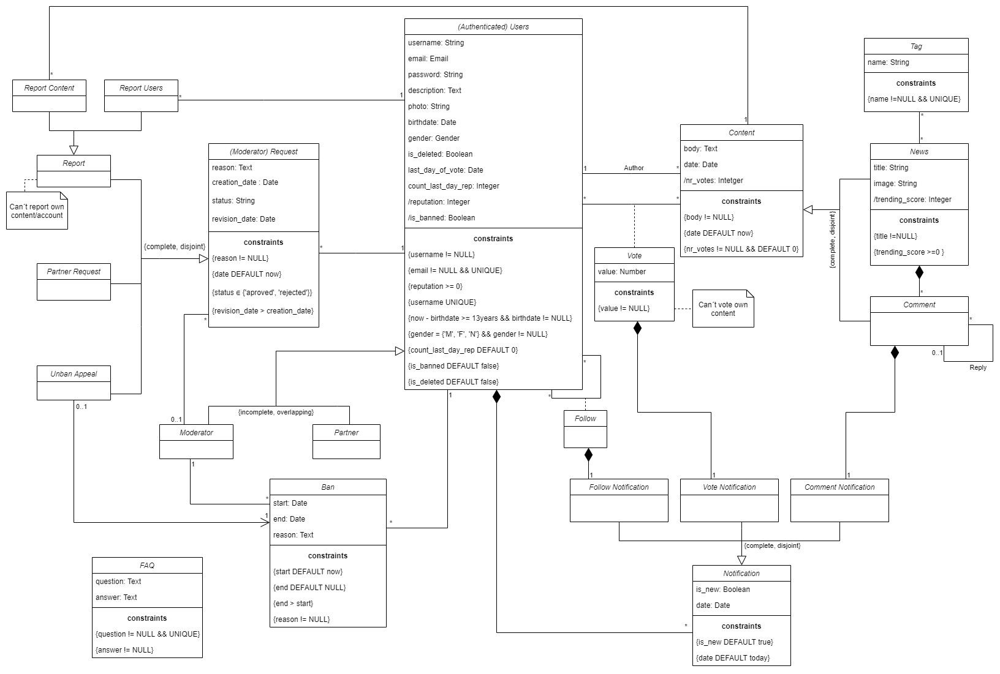

# EBD: Database Specification Component

This project intends to build a Collaborative news website, where anyone can read, publish news and share them with friends, while avoiding the spread of fake news.

## A4: Conceptual Data Model

The diagram of Figure 1 presents the main organisational entities, the relationships between them, attributes and their domains, and the multiplicity of relationships for **XEKKIT**.

### 1. Class diagram

| |
|---|
|Figure 1: UML conceptual data model |

Generalisations:  
User - overlapping, complete  
Content - disjoint, complete  
Report - disjoint, complete  
Notification - disjoint, complete  

### 2. Additional Business Rules
 
All business rules are represented in the UML diagram.


---


## A5: Relational Schema, validation and schema refinement

The artifact presented in this section contains the Relational Schema obtained by mapping from the Conceptual Data Model (A4). 

### 1. Relational Schema

| Relation reference | Relation Compact Notation                        |
| ------------------ | ------------------------------------------------ |
| R01                | users(**id**, username UK NN, email UK NN, password, description, photo UK, birthdate NN, gender NN CK gender IN GENDER_TYPE, reputation NN DF 0 CK reputation >= 0, is_moderator NN DF false, is_partner NN DF false, is_banned NN DF false, is_deleted NN DF false) |
| R02                | follow(**follower_id** → users NN, **users_id** → users NN)
| R03                | ban(**id**, users_id → users NN, moderator_id → users NN, start_date NN DF TODAY, end_date DF NULL CK end > start, reason NN) |
| R04                | content(**id**, author_id → users NN, body NN, date NN DF TODAY, nr_votes NN DF 0) |  
| R05                | tag(**id**, name NN UK) |
| R06                | news(**content_id** → content, title NN, image UK, trending_score NN CK trending_score >= 0) |
| R07                | news_tag(**news_id** → news NN, **tag_id** → tag NN ) |
| R08                | comment(**content_id** → content, news_id → news NN, reply_to_id → comment) |
| R09                | request(**id**, from_id → users NN, moderator_id → users NN, reason NN, creation_date NN DF TODAY, status CK status IN STATUS_TYPE, revision_date CK revision_date > creation_date) |
| R10                | report_users(**request_id** → request, to_users_id → users NN) |
| R11                | report_content(**request_id** → request, to_content_id → content NN) |
| R12                | partner_request(**request_id** → request) |
| R13                | unban_appeal(**request_id** → request, ban_id → ban NN) |
| R14                | vote(**users_id** → users, **content_id** → content, value NN) |
| R15                | follow_notification(**follower_id** → users, **users_id** → users, is_new NN DF true, creation_date DF TODAY) |
| R16                | vote_notification(**voter_id** → users, **content_id** → content, **author_id** → users, is_new NN DF true, creation_date DF TODAY) |
| R17                | comment_notification(**users_id** → users, **comment_id** → comment, is_new NN DF true, creation_date DF TODAY) |
| R18                | faq(**id**, question NN UK, answer NN) |

where UK means UNIQUE KEY, NN means NOT NULL, DF means DEFAULT and CK means CHECK.

#### 1.1 Generalizations
- **Content Generalization**: Subclasses point to the Superclass → the Content table has too many relations with other classes.
- **Request Generalization**: Subclasses point to the Superclass → each subclass will have different relations.
- **User Generalization**: One relation with all the attributes of all the classes → good approach for a heavily overlapping generalization with a small number of subclasses
- **Report Generalization**: Only subclasses are represented → there is no internal information stored in this classes, only external connections.
- **Notification Generalization**: Only subclasses are represented → it is a disjoint generalization and the few information that belongs to the superclass will be accessed every time we access the subclasses.

### 2. Domains

Specification of additional domains:  

| Domain Name  | Domain Specification        |
| ------------ | --------------------------- |
| GENDER_TYPE  | ENUM('m','f','n')           |
| TODAY        | DATE DEFAULT CURRENT_DATE   |
| STATUS_TYPE  | ENUM('aproved', 'rejected') | 


### 3. Schema validation

| **TABLE R01**   | users |
| --------------  | ---- |
| **Keys**        | {id}, {email}, {username}, {photo} |
| **Functional Dependencies:** |
| FD0101          | id → {username, email, password, description, photo, birthdate, gender, reputation, is_moderator, is_partner, is_banned, is_deleted} |
| FD0102          | username → {id, email, password, description, photo, birthdate, gender, reputation, is_moderator, is_partner, is_banned, is_deleted} |
| FD0103          | email → {id, username, password, description, photo, birthdate, gender, reputation, is_moderator, is_partner, is_banned, is_deleted} |
| FD0104          | photo → {id, email, username, password, description, birthdate, gender, reputation, is_moderator, is_partner, is_banned, is_deleted} |
| **NORMAL FORM** | BCNF |

| **TABLE R02**   | follow |
| --------------  | --- |
| **Keys**        | {follower_id, users_id} |
| **Functional Dependencies:** |
| (none) | |
| **NORMAL FORM** | BCNF |

| **TABLE R03**   | ban |
| --------------  | --- |
| **Keys**        | {id} |
| **Functional Dependencies:** |
| FD0501          | id → {users_id, moderator_id, start_date, end_date, reason} |
| **NORMAL FORM** | BCNF |

| **TABLE R04**   | content |
| --------------  | --- |
| **Keys**        | {id} |
| **Functional Dependencies:** |
| FD01701          | id → {author_id, body, date, nr_votes} |
| **NORMAL FORM** | BCNF |

| **TABLE R05**   | tag |
| --------------  | --- |
| **Keys**        | {id}, {name} |
| **Functional Dependencies:** |
| FD01101         | id → {name} |
| FD01101         | name → {id} |
| **NORMAL FORM** | BCNF |

| **TABLE R06**   | news |
| --------------  | ---- |
| **Keys**        | {content_id}, {image} |
| **Functional Dependencies:** |
| FD0901          | content_id → {title, image, trending_score} |
| FD0901          | image → {content_id, title, trending_score} |
| **NORMAL FORM** | BCNF |

| **TABLE R07**   | news_tag |
| --------------  | --- |
| **Keys**        | {news_id, tag_id} |
| **Functional Dependencies:** |
| (none)          ||
| **NORMAL FORM** | BCNF |

| **TABLE R08**   | comment |
| --------------  | ------- |
| **Keys**        | {content_id} |
| **Functional Dependencies:** |
| FD01001          | content_id → {news_id, reply_to_id} |
| **NORMAL FORM** | BCNF |

| **TABLE R09**   | request |
| --------------  | --- |
| **Keys**        | {id} |
| **Functional Dependencies:** |
| FD0601          | id → {from_id, moderator_id, reason, creation_date, status, revision_date} |
| **NORMAL FORM** | BCNF |

| **TABLE R10**   | report_users |
| --------------  | --- |
| **Keys**        | {request_id} |
| **Functional Dependencies:** |
| FD01301          | request_id → {to_users_id} |
| **NORMAL FORM** | BCNF |

| **TABLE R11**   | report_content |
| --------------  | --- |
| **Keys**        | {request_id} |
| **Functional Dependencies:** |
| FD01401          | request_id → {to_content_id} |
| **NORMAL FORM** | BCNF |

| **TABLE R12**   | partner_request |
| --------------  | --- |
| **Keys**        | {request_id} |
| **Functional Dependencies:** |
| (none)          ||
| **NORMAL FORM** | BCNF |

| **TABLE R13**   | unban_appeal |
| --------------  | --- |
| **Keys**        | {request_id} |
| **Functional Dependencies:** |
| FD01601          | request_id → {ban_id} |
| **NORMAL FORM** | BCNF |

| **TABLE R14**   | vote |
| --------------  | --- |
| **Keys**        | {users_id, content_id} |
| **Functional Dependencies:** |
| FD0401          | users_id, content_id → {value} |
| **NORMAL FORM** | BCNF |

| **TABLE R15**   | follow_notification |
| --------------  | --- |
| **Keys**        | {follower_id, users_id} |
| **Functional Dependencies:**  |
| FD0301          | follower_id, users_id → {is_new, creation_date} |
| **NORMAL FORM** | BCNF |

| **TABLE R16**   | vote_notification |
| --------------  | --- |
| **Keys**        | {voter_id, content_id, author_id} |
| **Functional Dependencies:**  |
| FD0301          | voter_id, content_id, author_id → {is_new, creation_date} |
| **NORMAL FORM** | BCNF |

| **TABLE R17**   | comment_notification |
| --------------  | --- |
| **Keys**        | {users_id, comment_id} |
| **Functional Dependencies:**  |
| FD0301          | users_id, comment_id → {is_new, creation_date} |
| **NORMAL FORM** | BCNF |

| **TABLE R18**   | faq |
| --------------  | --- |
| **Keys**        | {id}, {question} |
| **Functional Dependencies:** |
| FD0801          | id → {question, answer} |
| FD0802          | question → {id, answer} |
| **NORMAL FORM** | BCNF |

Since all relations are in the Boyce-Codd Normal Form (BCNF), the relational schema is also in BCNF and therefore there is no need to be defined using normalisation.  

---


## A6: Indexes, triggers, user functions, transactions and population

> Brief presentation of the artefact goals.

This artefact contains: 
- the physical schema of the database;
- the identification and characterisation of the indexes
- the support of data integrity rules with triggers
- the definition of the database user-defined functions
- the database's workload
- the complete database creation script, including all SQL necessary to define all integrity constraints, indexes and triggers
  
This artefact shows the database transactions needed to assure the integrity of the data in the presence of concurrent accesses.

For each transaction, the isolation level is explicitly stated and justified and read-only transactions to improve global performance are identified and justified. This artefact also contains the database's workload as well as the complete database creation script, 

### 1. Database Workload
 
> A study of the predicted system load (database load), organized in subsections.  
 
#### 1.1. Tuple Estimation
 
> Estimate of tuples at each relation.  

| **Relation reference** | **Relation Name** | **Order of magnitude** | **Estimated growth** |
| ------------------ | ------------- | ------------------------- | -------- |
| R01                | users | thousands | units per day
| R02                | follow | tens of thousands | hundreds per day
| R03                | ban | hundreds | units per week
| R04                | content | hundreds of thousands | thousands per day
| R05                | tag | hundreds | hundreds per day
| R06                | news | thousands | hundreds per day
| R07                | news_tag | units | dozens per day
| R08                | comment | hundreds of thousands | thousands per day
| R09                | request | thousands | dozens per day
| R10                | report_users | hundreds | units per day
| R11                | report_content | thousands | dozens per day 
| R12                | partner_request | dozens | units per week   
| R13                | unban_appeal | hundreds | units per week
| R14                | vote | millions | thousand per day
| R15                | follow_notification | tens of thousands | hundreds per day
| R16                | vote_notification | millions | thousand per day
| R17                | comment_notification | hundreds of thousands | thousands per day
| R18                | faq | dozens | units per month


#### 1.2. Frequent Queries
 
> Most important queries (SELECT) and their frequency.  

| **Query**       | SELECTXX                               |
| ---             | ---                                    |
| **Description** | One sentence describing the query goal |
| **Frequency**   | magnitude per time                     |
| `SQL code`                                              ||


| **Query**       | SELECT01                               |
| ---             | ---                                    |
| **Description** | Display one specific News Post |
| **Frequency**   | Tens of thousands per day |
```sql
    SELECT news.title, news.image, content.nr_votes, news.nr_comments, content.body, content.date, users.username, users.is_partner
        FROM news, content, users
        WHERE news.content_id = $id 
            AND news.content_id = content.id
            AND content.author_id = users.id
            AND users.is_deleted = false;          
```

| **Query**       | SELECT02                               |
| ---             | ---                                    |
| **Description** | Get comments from Post |
| **Frequency**   | Tens of thousands per day |
```sql
    SELECT comment.content_id, content.body, content.date, content.nr_votes, users.username, users.is_partner, users.is_deleted, comment.reply_to_id
        FROM news, comment, content, users
        WHERE news.content_id = $id 
            AND comment.news_id = news.content_id
            AND content.author_id = users.id;
```

| **Query**       | SELECT03 |
| ---             | --- |
| **Description** | Tags from Post |
| **Frequency**   | Hundreds of thousands per day |
```sql
    SELECT tag.name
        FROM news, news_tag, tag
        WHERE news.id = $id 
            AND news_tag.news_id = news.id
            AND tag.id = news_tag.tag_id;      
```

| **Query**       | SELECT04 |
| ---             | --- |
| **Description** | Get trending news |
| **Frequency**   | Hundreds of thousands per day |
```sql
    SELECT news.title, news.image, content.date, users.username, user.is_partner
        FROM news, content, users
        WHERE news.content_id = $id 
            AND news.content_id = content.id
            AND content.author_id = users.id
            AND users.is_deleted = false
        ORDER BY news.trending_score DESC;        
```

| **Query**       | SELECT05 |
| ---             | --- |
| **Description** | Get all recent news |
| **Frequency**   | Hundreds of thousands per day |
```sql
    SELECT news.title, news.image, content.nr_votes, news.nr_comments, content.body, content.date, users.username, users.is_partner
        FROM news, content, users
        WHERE news.content_id = content.id
            AND content.author_id = users.id
            AND users.is_deleted = false
        ORDER BY content.date DESC
        OFFSET $offset
        LIMIT 25;        
```

| **Query**       | SELECT01 |
| ---             | --- |
| **Description** | Get recent news for main page when logged in |
| **Frequency**   | Hundreds of thousands per day |
```sql
    SELECT news.title, news.image, content.date, content.body, content.nr_votes, users.username, user.is_partner
        FROM news, content, users
        WHERE news.content_id = content.id
            AND content.author_id = users.id
            AND users.is_deleted = false
            AND content.author_id IN (SELECT follow.users_id FROM follow  WHERE follow.follower_id = $my_users_id)
        ORDER BY content.date DESC;
        OFFSET $offset
        LIMIT 25;      
```


| **Query**       | SELECT07                               |
| ---             | ---                                    |
| **Description** | User Profile |
| **Frequency**   | Hundreds per day                     |
```sql
    SELECT users.username,users.description,users.photo,users.birthdate,users.gender,users.is_deleted,users.is_banned,users.reputation, users.is_partner, users.is_moderator
    WHERE users.id = $id ;
          
```

| **Query**       | SELECT08                               |
| ---             | ---                                    |
| **Description** | User Posts |
| **Frequency**   | Hundreds per day                     |
```sql
    SELECT news.* from users
    INNER JOIN content on content.author_id=id
    INNER JOIN news on news.content_id=content.id
    WHERE users.id = $id ;
          
```

#### 1.3. Frequent Updates

> Most important updates (INSERT, UPDATE, DELETE) and their frequency.  

| **Query**       | UPDATE01                               |
| ---             | ---                                    |
| **Description** | One sentence describing the query goal |
| **Frequency**   | magnitude per time                     |
| `SQL code`                                              ||

### 2. Proposed Indices

#### 2.1. Performance Indices

> Indices proposed to improve performance of the identified queries.  

| **Index**           | IDX01                                  |
| ---                 | ---                                    |
| **Related queries** | SELECT01, ...                          |
| **Relation**        | Relation where the index is applied    |
| **Attribute**       | Attribute where the index is applied   |
| **Type**            | B-tree, Hash, GiST or GIN              |
| **Cardinality**     | Attribute cardinality: low/medium/high |
| **Clustering**      | Clustering of the index                |
| **Justification**   | Justification for the proposed index   |
| `SQL code`                                                  ||
 
#### 2.2. Full-text Search Indices 

> The system being developed must provide full-text search features supported by PostgreSQL. Thus, it is necessary to specify the fields where full-text search will be available and the associated setup, namely all necessary configurations, indexes definitions and other relevant details.  

| **Index**           | IDX01                                  |
| ---                 | ---                                    |
| **Related queries** | SELECT01, ...                          |
| **Relation**        | Relation where the index is applied    |
| **Attribute**       | Attribute where the index is applied   |
| **Type**            | B-tree, Hash, GiST or GIN              |
| **Clustering**      | Clustering of the index                |
| **Justification**   | Justification for the proposed index   |
| 
```sql
CREATE INDEX search_content_title_idx ON content USING GIST (setweight(to_tsvector('english', content.title),'A'));
CREATE INDEX search_content_body_idx ON content USING GIST (setweight(to_tsvector('english', content.body),'C'));
CREATE INDEX search_tag_idx ON tag USING GIST (setweight(to_tsvector('english', tag.name),'B'));
CREATE INDEX search_username_idx ON tag USING GIST (setweight(to_tsvector('simple', users.username),'B'));
```
||
### 3. Triggers
 
> User-defined functions and trigger procedures that add control structures to the SQL language or perform complex computations, are identified and described to be trusted by the database server. Every kind of function (SQL functions, Stored procedures, Trigger procedures) can take base types, composite types, or combinations of these as arguments (parameters). In addition, every kind of function can return a base type or a composite type. Functions can also be defined to return sets of base or composite values.  

| **Trigger**      | TRIGGER01                              |
| ---              | ---                                    |
| **Description**  | Trigger description, including reference to the business rules involved |
| `SQL code`

| **Trigger**      | TRIGGER01                              |
| ---              | ---                                    |
| **Description**  | Ensure that only moderators can approve / reject requests |
| `SQL code` | ```sql`

`` |

### 4. Transactions
 
> Transactions needed to assure the integrity of the data.  

| SQL Reference   | Transaction Name                    |
| --------------- | ----------------------------------- |
| Justification   | Justification for the transaction.  |
| Isolation level | Isolation level of the transaction. |
| `Complete SQL Code`                                   ||

### 5. Complete SQL Code
 
> The database script must also include the SQL to populate a database with test data with an amount of tuples suitable for testing and with plausible values for the fields of the database.  
> This code should also be included in the group's git repository as an SQL script, and a link include here.  

#### 5.1. Database schema

#### 5.2. Database population


## Annex A. SQL Code

> The database scripts are included in this annex to the EBD component.
> 
> The database creation script and the population script should be presented as separate elements.
> The creation script includes the code necessary to build (and rebuild) the database.
> The population script includes an amount of tuples suitable for testing and with plausible values for the fields of the database.
>
> This code should also be included in the group's git repository and links added here.

### A.1. Database schema

```sql
DROP TABLE IF EXISTS faq CASCADE;
DROP TABLE IF EXISTS comment_notification CASCADE;
DROP TABLE IF EXISTS vote_notification CASCADE;
DROP TABLE IF EXISTS follow_notification CASCADE;
DROP TABLE IF EXISTS vote CASCADE;
DROP TABLE IF EXISTS unban_appeal CASCADE;
DROP TABLE IF EXISTS partner_request CASCADE;
DROP TABLE IF EXISTS report_content CASCADE;
DROP TABLE IF EXISTS report_users CASCADE; 
DROP TABLE IF EXISTS request CASCADE;
DROP TABLE IF EXISTS news_tag CASCADE;
DROP TABLE IF EXISTS news CASCADE;
DROP TABLE IF EXISTS tag CASCADE;
DROP TABLE IF EXISTS ban CASCADE;
DROP TABLE IF EXISTS content CASCADE;
DROP TABLE IF EXISTS comment CASCADE;
DROP TABLE IF EXISTS follow CASCADE;
DROP TABLE IF EXISTS users CASCADE;

DROP TYPE IF EXISTS GENDER_TYPE CASCADE;
DROP TYPE IF EXISTS STATUS_TYPE CASCADE;

CREATE TYPE GENDER_TYPE AS ENUM('m','f','n');
CREATE TYPE STATUS_TYPE AS ENUM('aproved', 'rejected');

CREATE TABLE users(
    id INTEGER GENERATED ALWAYS AS IDENTITY,
    username VARCHAR(20) NOT NULL UNIQUE,
    email TEXT NOT NULL UNIQUE,
    password TEXT NOT NULL,
    description TEXT,
    photo TEXT,
    birthdate DATE NOT NULL, /* add trigger to check age > 13 */
    gender GENDER_TYPE NOT NULL,
    reputation INTEGER NOT NULL DEFAULT 0 CHECK (reputation >=0),
    is_moderator BOOLEAN NOT NULL DEFAULT false,
    is_partner BOOLEAN NOT NULL DEFAULT false,
    is_banned BOOLEAN NOT NULL DEFAULT false,
    is_deleted BOOLEAN NOT NULL DEFAULT false,
    PRIMARY KEY(id)
);

CREATE TABLE follow(
    follower_id INTEGER NOT NULL,
    users_id INTEGER NOT NULL,
    PRIMARY KEY(follower_id, users_id),
    CONSTRAINT fk_follower_id
        FOREIGN KEY(follower_id) 
            REFERENCES users (id)
            ON DELETE CASCADE,
    CONSTRAINT fk_users_id
        FOREIGN KEY(users_id) 
            REFERENCES users (id)
            ON DELETE CASCADE
);

CREATE TABLE ban(
    id INTEGER GENERATED ALWAYS AS IDENTITY,
    users_id INTEGER NOT NULL,
    moderator_id INTEGER NOT NULL, /*CHECK users.is_moderator == true with triggers*/
    start_date TIMESTAMP WITH TIME ZONE DEFAULT now() NOT NULL,
    end_date TIMESTAMP WITH TIME ZONE  DEFAULT NULL CHECK (end_date > start_date),
    reason TEXT NOT NULL,
    PRIMARY KEY(id),
    CONSTRAINT fk_moderator_id
        FOREIGN KEY(moderator_id) 
            REFERENCES users (id)
            ON DELETE CASCADE,
     CONSTRAINT fk_users_id
        FOREIGN KEY(users_id) 
	        REFERENCES users (id)
	        ON DELETE CASCADE
        
);

CREATE TABLE content (
    id INTEGER GENERATED ALWAYS AS IDENTITY,
    author_id INTEGER NOT NULL,
    body TEXT NOT NULL,
    date TIMESTAMP WITH TIME ZONE DEFAULT now() NOT NULL,
    nr_votes INTEGER NOT NULL DEFAULT 0,
    PRIMARY KEY(id),
    CONSTRAINT fk_author_id
        FOREIGN KEY(author_id) 
	        REFERENCES users (id)
	        ON DELETE CASCADE
);

CREATE TABLE tag (
    id INTEGER GENERATED ALWAYS AS IDENTITY,
    name VARCHAR(20) NOT NULL UNIQUE,
    PRIMARY KEY(id)
);

CREATE TABLE news (
    content_id INTEGER NOT NULL,
    title TEXT NOT NULL,
    image TEXT UNIQUE,
    trending_score INTEGER NOT NULL CHECK (trending_score >= 0),
    PRIMARY KEY(content_id),
    CONSTRAINT fk_content_id
        FOREIGN KEY(content_id) 
	        REFERENCES content (id)
	        ON DELETE CASCADE
    
);

CREATE TABLE news_tag (
    news_id INTEGER,
    tag_id INTEGER,
    PRIMARY KEY(news_id, tag_id),
    CONSTRAINT fk_news_id
        FOREIGN KEY(news_id) 
	        REFERENCES  news (content_id)
	        ON DELETE CASCADE,
    CONSTRAINT fk_tag_id
        FOREIGN KEY(tag_id) 
	        REFERENCES  tag (id)
	        ON DELETE CASCADE
);

CREATE TABLE comment (
    content_id INTEGER NOT NULL,
    news_id INTEGER NOT NULL,
    reply_to_id INTEGER,
    PRIMARY KEY(content_id),
    CONSTRAINT fk_content_id
        FOREIGN KEY(content_id) 
	        REFERENCES content (id)
	        ON DELETE CASCADE,
    CONSTRAINT fk_news_id
        FOREIGN KEY(news_id) 
	        REFERENCES news (content_id)
	        ON DELETE CASCADE,
    CONSTRAINT fk_reply_to_id
        FOREIGN KEY(reply_to_id) 
	        REFERENCES comment (content_id)
	        ON DELETE CASCADE
);

CREATE TABLE request (
   id INTEGER GENERATED ALWAYS AS IDENTITY,
   from_id INTEGER NOT NULL,
   moderator_id INTEGER NOT NULL, /* CHECK moderator_id.is_moderator == true WITH TRIGGERS*/
   reason TEXT NOT NULL,
   creation_date TIMESTAMP WITH TIME ZONE DEFAULT now() NOT NULL,
   status STATUS_TYPE,
   revision_date TIMESTAMP WITH TIME ZONE CHECK (revision_date > creation_date),
   PRIMARY KEY(id),
   CONSTRAINT fk_from_id
        FOREIGN KEY(from_id) 
	        REFERENCES users (id)
	        ON DELETE CASCADE,
    CONSTRAINT fk_moderator_id
        FOREIGN KEY(moderator_id) 
	        REFERENCES users (id)
	        ON DELETE CASCADE
); 

CREATE TABLE report_users (
    request_id INTEGER NOT NULL,
    to_users_id INTEGER NOT NULL,
    PRIMARY KEY(request_id),
    CONSTRAINT fk_request_id
        FOREIGN KEY(request_id) 
	        REFERENCES request (id)
	        ON DELETE CASCADE,
    CONSTRAINT fk_to_users_id
        FOREIGN KEY(to_users_id) 
	        REFERENCES users (id)
	        ON DELETE CASCADE
);

CREATE TABLE report_content (
    request_id INTEGER NOT NULL,
    to_content_id INTEGER NOT NULL,
    PRIMARY KEY(request_id),
    CONSTRAINT fk_request_id
        FOREIGN KEY(request_id) 
	        REFERENCES request (id)
	        ON DELETE CASCADE,
    CONSTRAINT fk_to_content_id
        FOREIGN KEY(to_content_id) 
	        REFERENCES content (id)
	        ON DELETE CASCADE
);

CREATE TABLE partner_request (
    request_id INTEGER NOT NULL,
    PRIMARY KEY(request_id),
    CONSTRAINT fk_request_id
        FOREIGN KEY(request_id) 
	        REFERENCES request (id)
	        ON DELETE CASCADE
);

CREATE TABLE unban_appeal (
    request_id INTEGER NOT NULL,
    ban_id INTEGER NOT NULL,
    PRIMARY KEY(request_id),
    CONSTRAINT fk_request_id
        FOREIGN KEY(request_id) 
	        REFERENCES request (id)
	        ON DELETE CASCADE,
    CONSTRAINT fk_ban_id
        FOREIGN KEY(ban_id) 
	        REFERENCES ban (id)
	        ON DELETE CASCADE
);

CREATE TABLE vote (
    users_id INTEGER,
    content_id INTEGER, /*CHECK content.author_id != users_id */
    value INTEGER NOT NULL,
    PRIMARY KEY(users_id, content_id),
    CONSTRAINT fk_users_id
        FOREIGN KEY(users_id) 
	        REFERENCES users (id)
	        ON DELETE CASCADE,
    CONSTRAINT fk_content_id
        FOREIGN KEY(content_id) 
	        REFERENCES content (id)
	        ON DELETE CASCADE
);

CREATE TABLE follow_notifications (
    follower_id INTEGER,
    users_id INTEGER,
    in_new BOOLEAN NOT NULL DEFAULT true,
    creation_date TIMESTAMP WITH TIME ZONE DEFAULT now() NOT NULL,
    PRIMARY KEY(follower_id, users_id),
    CONSTRAINT fk_follower_id
        FOREIGN KEY(follower_id) 
	        REFERENCES users (id)
	        ON DELETE CASCADE,
    CONSTRAINT fk_users_id
        FOREIGN KEY(users_id) 
	        REFERENCES users (id)
	        ON DELETE CASCADE
);

CREATE TABLE vote_notification (
    voter_id INTEGER,
    content_id INTEGER,
    author_id INTEGER,
    in_new BOOLEAN NOT NULL DEFAULT true,
    creation_date TIMESTAMP WITH TIME ZONE DEFAULT now() NOT NULL,
    PRIMARY KEY(voter_id, content_id, author_id),
    CONSTRAINT fk_voter_id
        FOREIGN KEY(voter_id) 
	        REFERENCES users (id)
	        ON DELETE CASCADE,
    CONSTRAINT fk_content_id
        FOREIGN KEY(content_id) 
	        REFERENCES content (id)
	        ON DELETE CASCADE,
    CONSTRAINT fk_author_id
        FOREIGN KEY(author_id) 
	        REFERENCES users (id)
	        ON DELETE CASCADE
);

CREATE TABLE comment_notification (
    users_id INTEGER,
    comment_id INTEGER,
    in_new BOOLEAN NOT NULL DEFAULT true,
    creation_date TIMESTAMP WITH TIME ZONE DEFAULT now() NOT NULL,
    PRIMARY KEY(users_id, comment_id),
    CONSTRAINT fk_users_id
        FOREIGN KEY(users_id) 
	        REFERENCES users (id)
	        ON DELETE CASCADE,
    CONSTRAINT fk_comment_id
        FOREIGN KEY(comment_id) 
	        REFERENCES comment (content_id)
	        ON DELETE CASCADE
);

CREATE TABLE faq (
    id INTEGER GENERATED ALWAYS AS IDENTITY,
    question TEXT NOT NULL UNIQUE,
    answer TEXT NOT NULL,
    PRIMARY KEY(id)
);

```


### A.2. Database population


---


## Revision history

Changes made to the first submission:
1. Item 1
1. ..

***
GROUP2114, 28/03/2021
 
 - Beatriz Mendes, up201806551@fe.up.pt (A3 Review)
 - Guilherme Calassi, up201800157@fe.up.pt
 - Luís André Assunção, up201806140@fe.up.pt
 - Ricardo Cardoso, up201604686@fe.up.pt (A1, A2 Review)
