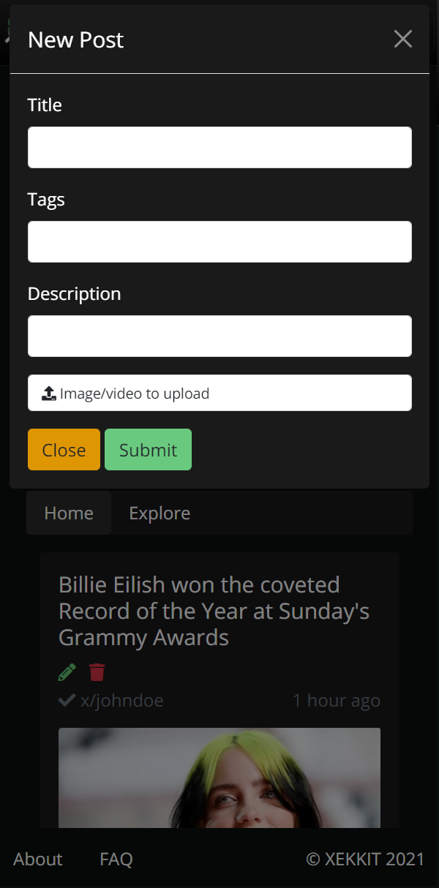
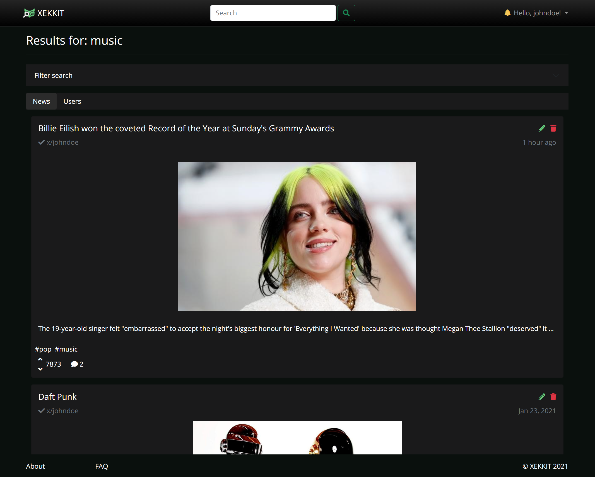
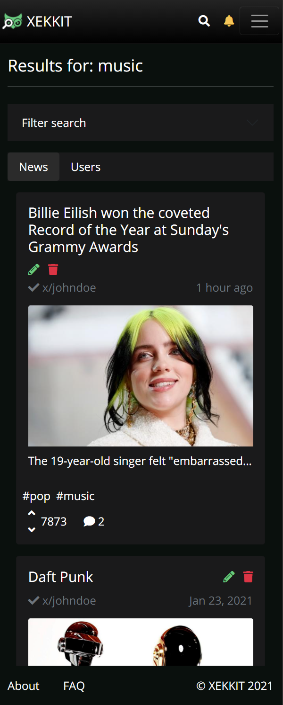
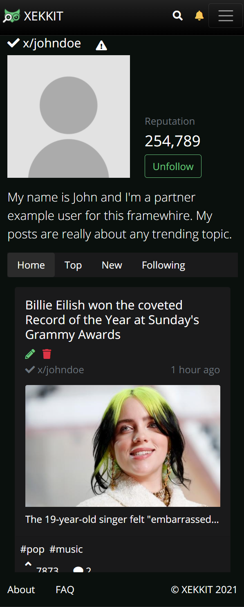
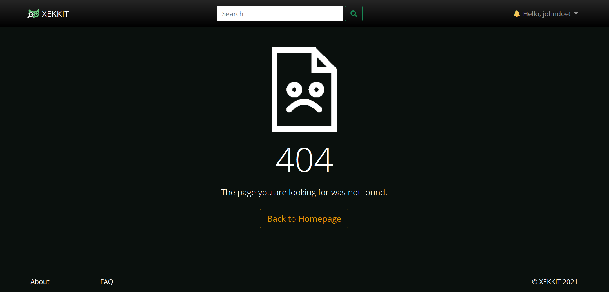

# ER - Requirements Specification
This project intends to build a Collaborative news website, where anyone can read, publish news and share them with friends, while avoiding the spread of fake news.

## A1 - XEKKIT

XEKKIT intends to be an information system with a web interface for a collaborative news management platform. 
Nowadays, it is crucial for people to search trusted news sources, minimizing the spread of fake news. 

In this context we decided to create our project, a Collaborative News website where freelance jornalists can earn reputation with their hard work and help keep the community informed about local and world news.

The platform will have an adaptive design and a detailed navigation system by arranging the news by themes. Besides text, title and a picture, each news will have keywords that will allow the user to quickly find what he needs through the search bar and a comments section, where other users can share their opinion about the article.
To achieve our goal of preventing the spread of fake news, we intend to implement a voting system. Higher votes means more trustable. This system will allow users to not only review the news they read but also find which one's are trusted by the community. Comments will also have a voting system. This system allows for each user to have a public reputation score, based on the news and comments they published. 
Users with very high reputation can request to be a partner. Partners are specially valued in the community and as such their news are considered more relevant and appear first in the homepage. Upvotes casted by partners are also more valuable than a normal upvote.
To publish, comment and upvote, the user must be autheticated. Some users have access to moderator privileges, allowing them to remove news they find unsuitable for the website and ban users that disrespected community guidelines. 
Furhermore, each user can follow another and receive the news the latter publishes in a dedicated area.

Users will be distributed in three groups with different permissions: moderators, users and guests. A moderator will have all the privileges of access and modification. A user can publish, comment and vote, follow and be followed. A guest can only search and read the news. 

## A2 - Actors and User Stories

### 2.1 Actors

For the Collaborative News system, the actors are represented in Figure 1 and described in Table 1.

  
Figure 1: Actors

|Identifier|Description|Examples|
|-------|------|------|
|User|Generic user that can read articles|n/a
|Guest|Unauthenticated user that can register itself (sign-up) or sign-in in the system|n/a
|Authenticated User|Authenticated User that can create articles, comment and vote|n/a
|Author|Authenticated User that created an article or comment and can delete (maybe edit) such article or comment|n/a
|Moderator|Authenticated user that is responsible for the management of users and for some specific supervisory and moderation functions, such as remove third-party articles or comments and ban users|n/a
|Partner|Authenticated User with higher reputation|n/a
|Banned User|User that is no longer a generic user (can no longer authenticate with his email)|n/a
|OAuth API|External OAuth API that can be used to register or authenticate into the system|Google

Table 1: Actor's Description

### 2.2 User Stories

For the Collaborative News system, consider the user stories that are presented in the following sections.

----
#### 2.2.1 User
|Identifier|Name|Priority|Description|
|-------|------|------|------|
|US01| See News Feed | High |As an *User*, I want to access the news feed, so that I can see the top news for each topic.
|US02| See "Hot" Topics | High | As an *User*, I want to acced the "hot" topics section, so that I can see the news that have more interactions in a short time period
|US03| See "Recent" Topics | High |As an *User*, I want to acced the "recent" topics section, so that I can see the news were published recently
|US04| Search Using Keywords| High | As an *User*, I want to search news and user profiles, so that I can find news/users related to the keywords used on the search.
|US05| Sign-out | High | As an *User*, I want to sign-out from my account, so that I no longer have user privilegies.
|US06| Filter News | High | As an *User*, I want to be able to filter the news that show up after I search for a certain keywors, so that I can read the news that talk about what I wanted to read more about
|US07| View Profiles | High | As an *User*, I want to be able to view a profile, so that I can see the news posted by a certain user and his main information (username, achievements, date of the creation of the account)
|US08| Create Report | Medium | As an *User*, I want to report a(n) user/news/comment, so that the moderators can manage users/news/comments that go against the community guidelines.
|US09| Consult FAQ | Low | As an *User*, I want to see some FAQ, so that I can get fast answers to my questions.
|US010| Consult Contact | Low | As an *User*, I want to consult contacts, so that I can see a contact I might need.
|US011| See About | Low | As an *User*, I want to access the about page, so that I can see the website's description.

Table 2: User's User Stories
 
----
#### 2.2.2 Guest
|Identifier|Name|Priority|Description|
|-------|------|------|------|
|US11|Sign-in | High | As a *Guest*, I want to authenticate into the system, so that I can access privileged information.|
|US12|Register | High | As a *Guest*, I want to register into the system, so that I can authenticate myself into the system.|
|US13|Sign-in using Google OAuth API | Low | As a *Guest*, I want to sign-in through my Google account, so that I can authenticate myself into the system.|
|US14|Register using Google OAuth API | Low | As a *Guest*, I want to register a new account linked to my Google account, so that I can access privileged information.|

Table 3: Guest's User Stories

----
#### 2.2.3 Authenticated User
|Identifier|Name|Priority|Description|
|-------|------|------|------|
|US21| Personalized Feed | High | As an *Autheticated User*, I want to have a personalized feed, so that the news that are presented to me when I login are according to my preferences
|US22| Create News | High | As an *Autheticated User*, I want to create News, so that it is publicly available.
|US23| Create/Publish Comment | High | As an *Autheticated User*, I want to post a comment on News, so that I can manifest my opinion.
|US24| View Profile | High | As an *Authenticated User*, I want to see my profile, so that I can verify if all the information is correct.
|US25| Manage Profile | High | As an *Authenticated User*, I want to change my profile information (including my password), so that it can stay updated.
|US26| Follow/Unfollow Other User | High | As an *Authenticated User*, I want to follow/unfollow other user, so that his posts appear/stop appearing on my home page.
|US27| Sign Out | High | As an *Authenticated User*, I want to sign out of the system, so that I can become a guest
|US28| Vote | High | As an *Authenticated User*, I want to upvote/downvote (and even remove/change my vote on) any news/comments, so that I can manifest my like/dislike.
|US29| Delete Profile | High | As an *Authenticated User*, I want to be able to delete my profile, so that my profile page and account no longer exists.
|US210| Request Partner label | Medium | As an *Authenticated User*, I want to be able to create a request, so that I become a Partner.

Table 4: Authenticated User's User Stories

----
#### 2.2.4 Author
|Identifier|Name|Priority|Description|
|-------|------|------|------|
|US31|Edit News|High| As a *Author*, I want to edit a post I previously posted, so that I can keep the information updated.|
|US32|Remove News|High| As a *Author*, I want to remove a post I previously posted, so that it is no longer publicly available.|
|US33|Remove comment|High| As a *Author*, I want to remove a comment I previously posted, so that it is no longer publicly available.|
|US34|Edit comment|Medium| As a *Author*, I want to edit a comment I previously posted, so that I can keep the comment updated.|

Table 5: Author's User Stories

----
#### 2.2.5 Moderator
|Identifier|Name|Priority|Description|
|-------|------|------|------|
|US41|Remove Post from other User|High|As a *Moderator*, I want to remove a post from another user, so that I can improve the reliability of the news published in the website.
|US42|Remove Comment from another User|High|As a *Moderator*, I want to remove a comment from another user, so that I can improve the reliability of the news published in the website.
|US43|Ban User|Medium|As a *Moderator*, I want to be able to ban a user from the website, so the user won't be able to see anything on our website while logged in.
|US44|Verify Partner|Medium|As a *Moderator*, I want to be able to verify a user, so that the user reaches a bigger audience by becoming a Partner.
|US45|View Reports|Medium|As a *Moderator*, I want to be able so see all reports made by other users, so that I can decide how I'm gonna act on the report.
|US46|Act on Reports|Medium|As a *Moderator*, I want to be able act on a report, so that I can delete news/comments or ban users.
|US47|View Partner Rquests|Medium|As a *Moderator*, I want to be able so see all partner requests made by other users, so that I can decide how I'm gonna act on the requests.
|US48|Act on Partner Requests|Medium|As a *Moderator*, I want to be able act on a partner requests, so that I can give the achievement of "Partner".
|US49|Remove Partner|Low|As a *Moderator*, I want to be able to remove a partner without a user request, so that the partner no longer reaches a bigger audience with his posts.
|US410|Add FAQ| Low |As a *Moderator*, I want to be able to add a new Question and the respective Answer to the FAQ, so thet other Users can see it in the FAQ.

Table 6: Moderator's User Stories

----
#### 2.2.6 Partner
|Identifier|Name|Priority|Description|
|-------|------|------|------|
|US51|Stop Being a Partner|Medium|As a *Partner*, I want to be able to stop being a partner, so that my news no longer appear in the top of the user's feed.|

Table 7: Partner's User Stories

----
#### 2.2.7 Banned User
|Identifier|Name|Priority|Description|
|-------|------|------|------|
|US61|Unban Appeal|Low|As a *Banned User*, I want to be able to unban appeal, so that I can recover my banned account 

Table 8: Banned User's User Stories

### 2.3 Supplementary Requirements
This annex contains business rules, technical requirements and other non-functional requirements on the project.

----
#### 2.3.1 Business Rules
Identifier|Name|Description
|-------|------|------|
BR01 | Reputation System | Every Authenticated User has a reputation based on the upvotes or downvotes they got and gave. The minimum reputation value is 0.
BR02 | Partner | A User is only able to request the label of Partner when it reaches a reputation of 100,000.
BR03 | Unable to Self-vote | An Authenticated User can't vote on his own news/comments.
BR04 | User maximum reputation per day received by voting | An Authenticated User can only receive a maximum of 5 poins per day related to voting on other user's news/comments.
BR05 | Authenticated User Upvoting News | Authenticated User upvotes on news give 1 reputation point to the voting user and 5 reputation vote to the creator of the news voted on.
BR06 | Authenticated User Downvoting News | Authenticated User downvotes on news give 1 reputation point do the voting user and removes 5 reputation vote to the creator of the news voted on.
BR07 | Authenticated User Upvoting Comment | Authenticated User upvotes on comments give 1 reputation point do the voting user  and 1 reputation vote to the creator of the comment voted on.
BR08 | Authenticated User Downvoting Comment | Authenticated User downvotes on comments give 1 reputation point do the voting user and removes 1 reputation vote to the creator of the comment voted on.
BR09 | Partner Upvoting | Partner upvotes give 1 reputation point do the voting user  and 10 reputation vote to the creator of the news/comment voted on.
BR10 | Partner Downvoting | Partner downvotes give 1 reputation point do the voting user and removes 10 reputation vote to the creator of the news/comment voted on.
BR11 | Deleted Profile | When an Authenticated User is deleted, he's posts/comments/votes stay in the database, but the user profile page is deleted.
BR12 | Minimum age | The minimum age for a user to be registered is 13 years old.
BR13 | Partner's News Priority | A Partner's has a bigger probability to appear in the top of the user's feed
BR14 | Partner Achievement | Every Partner has a badge associated to his account that shows that he is a partner
BR15 | Banned User Failed Login | A Banned User can't login into his account
BR16 | Banned Email Failed Registration | A User that was previously banned can't register into a new account using the email associated with the banned account
BR17 | Unable to Self-Follow/Unfollow | An Authenticated User can't follow/unfollow himself
BR18 | Visualization System | Each new as a certain "visualization" score, that is used to sort the news in the user's feed (higher "visualization" score news have a bigger priority)
BR19 | Valorization of Recent News | Having two news, a recent one and an old one, if they have the same reputation, the recent one has an higher "visualization" score than the old one.

Table 9: Business Rules

---
#### 2.3.2 Technical Requirements

Identifier|Name|Description
|-------|------|------|
TR01|Availability|The system must be available 99 percent of the time in each 24-hour period.
TR02|Accessibility|The system must ensure that everyone can access the pages, regardless of whether they have any handicap or not, or the Web browser they use.
**TR03**|**Usability**|**The system should be simple and easy to use.**
TR04|Performance|The system should have response times shorter than 2s to ensure the user's attention.
TR05|Web application|The system should be implemented as a Web application with dynamic pages (HTML5, JavaScript, CSS3 and PHP).
TR06|Portability|The server-side system should work across multiple platforms (Linux, Mac OS, etc.).
TR07|Database|The PostgreSQL 9.4 database management system must be used.
TR08|Security|The system shall protect information from unauthorised access through the use of an authentication and verification system.
**TR09**|**Robustness**|**The system must be prepared to handle and continue operating when runtime errors occur.**
TR10|Scalability|The system must be prepared to deal with the growth in the number of users and their actions.
**TR11**|**Ethics**|**The system must respect the ethical principles in software development (for example, the password must be stored encrypted to ensure that only the owner knows it).**

We belive the most critical requirements are that our system should be easy to use, so that users don't get bored and leave when looking for something, should also be robust so that intentional (or even unintentional) invalid inputs don't crash the entire system and finally it should respect the ethical principles in software development so that, in case someone manages to hack us, sensible data remains encrypted.

Table 10: Technical Requirements

----
#### 2.3.3 Restrictions
Identifier|Name|Description
|-------|------|------|
C01|Deadline|End of semester.

Table 11: Restrictions

## A3 - User Interface Prototype

This user interface prototype has the main goals of helping to identify and analyse the user requirements and preview the user interface of the website to be developed.  
This artifact includes an overview of the interface and common features, a sitemap and the identification and description of the main user interactions (UI) with the system.

----
### 3.1 Interface and commmon features
**Xekkit** is a web application based on HTML5, JavaScript and CSS. The user interface was implemented using the Bootstrap framework.

 
Figure 1: Interface's guidelines.
 1. Logo 
 2. Navbar  
 3. Content 
 4. Footer 

In this figure some characteristics common to all the pages are highlighted:

The web design implemented has a fully responsive flow which allows the web page layout to suit any screen size and resolution greater than or equal to a 4'' smartphone.
The common links to the various pages maintain their position to make the user experience consistent.
Different sections have clearly distinct styles in order to highlight distinct hierarchies of information, and assist with the visual flow.

----
### 3.2 Sitemap

The site map gives the team an idea of the website structure and pages hierarchy.

 

Figure 2: [Sitemap](https://projects.invisionapp.com/freehand/document/yc9IALtkz).

----
### 3.3 Wireflows

Wireflows are presented to represent some of the main user interactions with the website.

 

Figure 3: [Wireflows](https://projects.invisionapp.com/freehand/document/yc9IALtkz). 

----
### 3.4 Interfaces
|Interfaces|
|----------| 
| [UI01: Main](#ui01:-main) | 
| [UI02: Main logged in](#ui02:-main-logged-in) | 
| [UI03: New Post](#ui03:-new-post) |
| [UI04: About](#ui04:-about) | 
| [UI05: FAQ](#ui05:-faq) | 
| [UI06: FAQ as Moderator](#ui06:-edit-faq-as-moderator) |
| [UI07: Log in](#ui07:-log-in) |
| [UI08: Sign Up](#ui08:-sign-Up) |
| [UI09: Post](#ui09:-post) |
| [UI10: Search](#ui10-search) |
| [UI11: Third-Party Profile](#ui11:-third-party-profile) |
| [UI12: My Profile](#ui12:-my-profile) |
| [UI13: Edit Profile](#ui13:-profile-partner) |
| [UI14: Ask For Partner](#ui14:-ask-for-partner) |
| [UI15: Notifications](#ui15:-notifications) |
| [UI16: Moderator Options](#ui16:-moderator-options) |
| [UI17: Banned User](#ui17:-banned-user) |
| [UI18: Page Not Found](#ui16:-page-not-found) |

----
#### UI01: Main

Main website page where you can consult trending news on top, last news on center and explore some tags on the right side.

| Desktop | Mobile |
|---------|--------|
|  |  |

Figure 4: [Main Page](http://lbaw2114-piu.lbaw-prod.fe.up.pt/pages/main.php). 

----
#### UI02: Main logged in

Main website page again with the difference that because of beeing logged in you can now create a new post. On collumn Mobile2 you can also see the search bar that appears when you press the search icon on the navigantion bar.

| Desktop | Mobile1 | Mobile2 |
|---------|---------|---------|
|  |  | 

Figure 5: [Main Page Logged in](http://lbaw2114-piu.lbaw-prod.fe.up.pt/pages/main_logged_in.php). 

----
#### UI03: New Post

Modal box where you can create a new post when logged in.

| Desktop | Mobile |
|---------|--------|
|  |  | 

Figure 6: [New Post](http://lbaw2114-piu.lbaw-prod.fe.up.pt/pages/main_logged_in.php) and then click on green button "Make new post".

----
#### UI04: About

In this page you can see our team and where we got our inspiration to build this website.

| Desktop | Mobile |
|---------|--------|
|  |  |
 
 Figure 6: [About Page](http://lbaw2114-piu.lbaw-prod.fe.up.pt/pages/about_us.php).

----
#### UI05: FAQ

Here is were you can se some of the most frequently asked questions about our website.

| Desktop | Mobile |
|---------|--------|
|  |  |

Figure 7: [FAQ Page](http://lbaw2114-piu.lbaw-prod.fe.up.pt/pages/faq.php).

----
#### UI06: Edit FAQ as Moderator

Here is were the motherator can edit and add questions to the FAQ page.

| Desktop | Mobile |
|---------|--------|
|  |  |
 
Figure 8: [FAQ Moderator](http://lbaw2114-piu.lbaw-prod.fe.up.pt/pages/faq_moderator.php).

----
#### UI07: Log in

In this page you can authenticate yourself in our website (if you already have an account).

| Desktop | Mobile |
|---------|--------|
|  |  |

Figure 10: [Log in](http://lbaw2114-piu.lbaw-prod.fe.up.pt/pages/login.php).

----
#### UI08: Sign Up

In this page yopu can create a new account.

| Desktop | Mobile |
|---------|--------|
|  |  |

Figure 11: [Sign Up](http://lbaw2114-piu.lbaw-prod.fe.up.pt/pages/register.php).

----
#### UI09: Post

This is the page were single news are presented, with the respective comments below. On desktop version you can see a card with some publisher info, while on mobile you can only see his name (with a link to his profile) on the top of the post card.  
If you are the owner of the post you are seeing, you have the option to edit or delete the post, but if you are not the owner a report button will appear instead.

| Desktop | Mobile |
|---------|--------|
| | |

Figure 12: [Post](http://lbaw2114-piu.lbaw-prod.fe.up.pt/pages/news.php).

----
#### UI10: Search

When you perform a search query (by typing on the serach bar) this is tha page were you land. In here you can filter your search and choose if you want to search for news or for users.

| Desktop | Mobile |
|---------|--------|
| | |
| | |
 
Figure 13 and 14: [Search](http://lbaw2114-piu.lbaw-prod.fe.up.pt/pages/search.php).

----
#### UI11: Third-Party Profile

This is how you can see other people's profiles. On the desktop version is an example of someone you don't follow, while on mobile version is an example of someone you follow. In this page you can not only see this user's posted news but also who he follows.

| Desktop | Mobile |
|---------|--------|
| | |
| | |

Figure 15 and 16: [Third-Party Profile (unfollow button)](http://lbaw2114-piu.lbaw-prod.fe.up.pt/pages/profile_other_unfollow.php) and [Third-Party Profile (follow button)](http://lbaw2114-piu.lbaw-prod.fe.up.pt/pages/profile_other_follow.php).

----
#### UI12: My Profile

This is how you can see your own profile. The difference between this page and the previous one is that you can't report/follow yourself but you can edit yourprofile.

| Desktop | Mobile |
|---------|--------|
|  | |

Figure 17: [My Profile](http://lbaw2114-piu.lbaw-prod.fe.up.pt/pages/profile.php).

----
#### UI13: Edit Profile

This is an example of how you can edit your profile. On the desktop version is an example of someone who is not Partner while on the mobile version is an example of someone that is partner.

| Desktop | Mobile |
|---------|--------|
| | |

Figure 18: [Edit Profile Partner](http://lbaw2114-piu.lbaw-prod.fe.up.pt/pages/edit_profile.php) and [Edit Profile non Partner](http://lbaw2114-piu.lbaw-prod.fe.up.pt/pages/edit_profile_no_partner.php).

----
#### UI14: Ask for Partner

When you click the button "Ask for Partner" a modal box will appear where you must describe why we should accept you as Partner.

| Desktop | Mobile |
|---------|--------|
|  |  |

Figure 19: [Edit Profile](http://lbaw2114-piu.lbaw-prod.fe.up.pt/pages/edit_profile.php) and then click on yellow button "Ask for Partner".

----
#### UI15: Notifications

When you click the yellow bell on the navigantion bar you end up in this page where you can see who voted/commented on your posted news.

| Desktop | Mobile |
|---------|--------|
|  |  |

Figure 20: [Notifications](http://lbaw2114-piu.lbaw-prod.fe.up.pt/pages/notifications.php).

----
#### UI16: Moderator Options

If you are a moderator of our website you will also have access to a tab inside the notifications page where you can manage moderator related events, sush as manage Partner/report requests.

| Desktop | Mobile |
|---------|--------|
|  |  |

Figure 21: [Moderator Options](http://lbaw2114-piu.lbaw-prod.fe.up.pt/pages/notifications.php) and then click on "Moderator" tab.

----
#### UI17: Banned User

If you were banned you will see this page.

| Desktop | Mobile |
|---------|--------|
|  |  |

Figure 21: [Banned User](http://lbaw2114-piu.lbaw-prod.fe.up.pt/pages/notifications.php) and then click on "Moderator" tab.

----
#### UI18: Page Not Found

If you try to access some page you don't have permissions to access or that doesn't exist you will end up in this page.

| Desktop | Mobile |
|---------|--------|
|  |  |

Figure 21: [Page Not Found](http://lbaw2114-piu.lbaw-prod.fe.up.pt/pages/404.php) and then click on "Moderator" tab.

# Revision history

Changes made since the first submission (15/03/2021):

----
GROUP2114, 15/03/2021
 
 - Beatriz Mendes, up201806551@fe.up.pt (A3 Review)
 - Guilherme Calassi, up201800157@fe.up.pt
 - Luís André Assunção, up201806140@fe.up.pt
 - Ricardo Cardoso, up201604686@fe.up.pt (A1, A2 Review)
